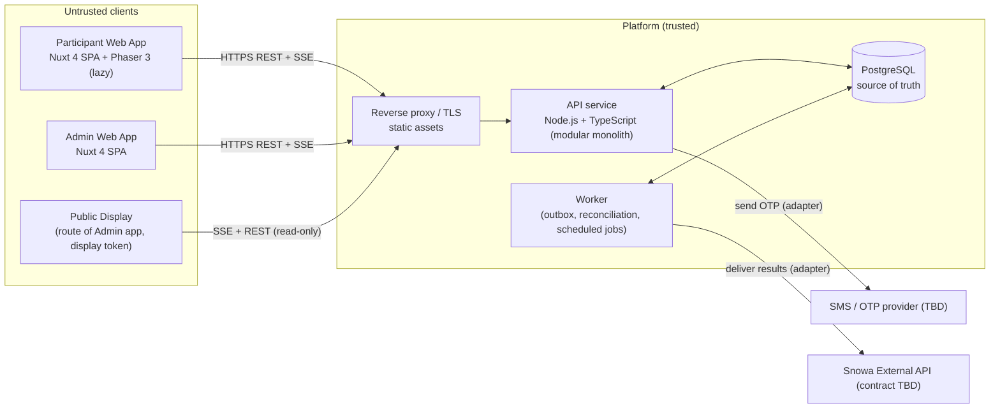
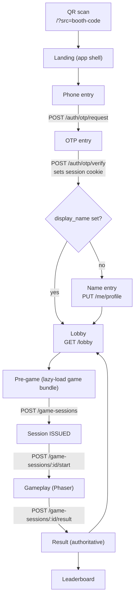

# Project Technical Overview

| Field | Value |
|---|---|
| Status | Phase 0 — Draft for approval |
| Product source | `docs/source/Snowa_Exhibition_Gaming_Platform_Product_Game_Design_Spec_v1.0.docx` (v1.0, 28 Sep 2026) — referred to as **SPEC** |
| Audience | Engineering (frontend, game, backend), QA, DevOps, event operations |

## 1. What is being built

An exhibition campaign platform for Snowa. Visitors scan a booth QR code, verify their phone by OTP, enter a display name (first visit only), and play up to three short score-based games in a mobile browser. Each game's first valid completion grants one base raffle ticket. Operators control games, attempts, extra rewards, live leaderboards and live raffle draws from an Admin Panel that acts as an event control room. Accepted results are forwarded to an external Snowa API.

The participant experience is **Persian, RTL, mobile-first, browser-first** (PWA installation optional, never required).

## 2. Architecture at a glance

Key properties:

| Concern | Decision (see ADRs) |
|---|---|
| Frontend | Nuxt 4 + Vue 3 + TypeScript, client-rendered SPA; Phaser 3 only inside gameplay routes, lazy-loaded per game ([ADR-001](../11-decisions/ADR-001-frontend-architecture.md), [ADR-006](../11-decisions/ADR-006-game-runtime.md)) |
| Backend | **Recommended**: Node.js 22 LTS + TypeScript + Fastify, modular monolith with a separate worker entrypoint ([ADR-002](../11-decisions/ADR-002-backend-technology.md)) — pending approval |
| Persistence | **Recommended**: PostgreSQL 16+ as the only stateful dependency; Redis deferred until load testing proves need ([ADR-004](../11-decisions/ADR-004-persistence.md)) |
| Real-time | **Recommended**: Server-Sent Events for server→client hints + REST for commands and authoritative state; participants mostly fetch on demand ([ADR-003](../11-decisions/ADR-003-realtime-transport.md)) |
| Score integrity | Server-authorized sessions + seeded deterministic gameplay + server-side replay of the action log with shared scoring code ([ADR-010](../11-decisions/ADR-010-score-validation.md)) |
| Rewards | Core base ticket as a fixed pipeline step guarded by a unique constraint; extra rewards through a data-driven rule engine with atomic inventory ([ADR-007](../11-decisions/ADR-007-reward-architecture.md)) |
| Raffle | Server-side weighted selection without replacement from a frozen, persisted eligibility snapshot, using a recorded CSPRNG seed so any draw can be recomputed ([ADR-011](../11-decisions/ADR-011-raffle-selection.md)) |
| External API | Transactional outbox + adapter; client never calls Snowa ([ADR-008](../11-decisions/ADR-008-external-integration.md)) |
| Deployment | Container-based, small VM footprint (reverse proxy, 2× API, 1× worker, PostgreSQL); provider TBD ([ADR-012](../11-decisions/ADR-012-deployment-topology.md)) |

## 3. Core invariants (non-negotiable, from SPEC §2 and §30.2)

1. Official score per participant per game = **maximum validated score across accepted attempts**. Never "latest".
2. Base raffle ticket = **exactly one per participant per game**, on first valid completion. Replays never add base tickets.
3. Attempts, eligibility, scores, tickets, rewards and draw winners are **decided by the server**.
4. Installation is **never required**.
5. The browser **never calls** the external Snowa API and never holds its credentials.
6. No combined event-wide leaderboard formula.
7. All participant-facing production text is **Persian/RTL**.

## 4. Participant journey (technical view)

## 5. Document map

See [`docs/README.md`](../README.md) for the full index. Recommended reading order for implementers:

1. [Scope](02-scope.md) and [Glossary](03-glossary.md)
2. [Trust boundaries](../01-architecture/09-trust-boundaries.md)
3. [Domain model](../02-domain/01-domain-model.md) and [Invariants & transactions](../03-data/03-invariants-and-transactions.md)
4. [Game session & score submission API](../04-api/03-game-session-api.md)
5. [Shared game runtime](../05-games/01-shared-game-runtime.md) + the per-game specs
6. [Open questions](../12-planning/04-open-questions.md) and [Phase 1 plan](../12-planning/01-phase-1-implementation-plan.md)

## 6. Conventions used in this documentation set

- **MUST / MUST NOT / SHOULD / MAY** follow RFC 2119 meaning.
- **[SPEC §x]** cites the product source section.
- **Assumption (A-nn)**: a technical assumption made to proceed; listed in [Open questions](../12-planning/04-open-questions.md#2-assumptions).
- **Open Question (OQ-nn)**: an unresolved product/technical decision with a recommended default.
- **Recommended Decision**: architecture recommendation awaiting approval (captured as an ADR with status *Proposed*).
- Technical identifiers are English (`spin-perfect`, `attempt_score`); participant-facing strings are Persian and live only in locale files.
