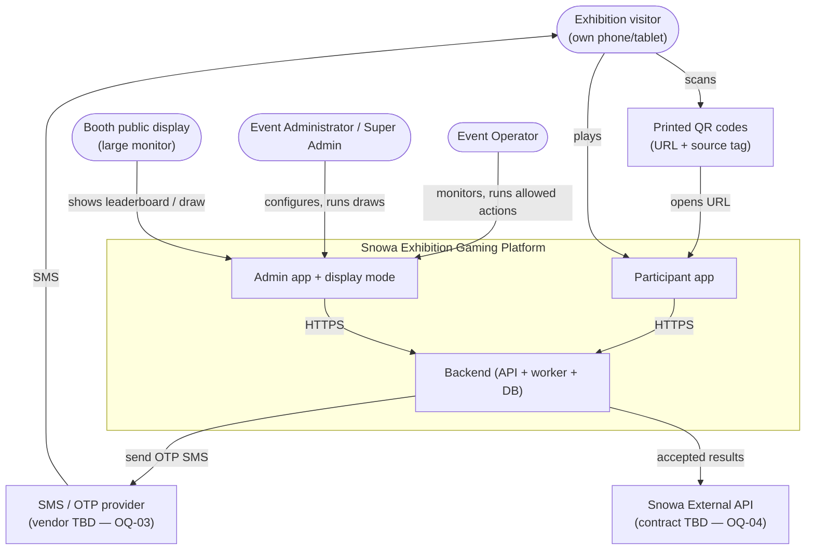

# System Context

## 1. Context diagram

## 2. Actors and external systems

| Actor / System | Trust | Interface | Notes |
|---|---|---|---|
| Participant | Untrusted | Participant app (browser) | Anonymous until OTP verified. May be malicious. |
| Event Operator | Authenticated, partially trusted | Admin app | Limited permissions; see [Roles](../06-admin/02-roles-and-permissions.md). |
| Event Administrator | Authenticated, trusted for config | Admin app | Critical actions confirmed and audited. |
| Super Admin | Highly trusted | Admin app | Integrations, admin management, emergency overrides. |
| Public display | Device-authenticated, read-only | Display route | Revocable display token; never receives full phone numbers. |
| SMS/OTP provider | External dependency | Server-to-server HTTPS via `OtpSender` adapter | Vendor TBD. Failures degrade onboarding only. |
| Snowa External API | External dependency | Server-to-server via `SnowaResultAdapter` | Contract TBD. Failures MUST NOT affect gameplay. |
| QR code | Static | URL `https://<participant-domain>/?src=<booth-code>` | `src` drives `qr_entry` analytics only; no security meaning. |

## 3. What the platform owns vs. does not own

| Owned (source of truth) | Not owned |
|---|---|
| Participant identity (phone + name), sessions | SMS delivery |
| Game availability, attempt limits, config versions | Snowa CRM/loyalty data |
| Game sessions, attempts, validated scores, best scores | Physical prize logistics outside the recorded fulfillment state |
| Tickets, reward definitions/rules/inventory/grants | Legal raffle rules (input from business/legal) |
| Draws, snapshots, winners | Brand assets (supplied by Snowa) |
| Audit log, delivery outbox | External system's deduplication |

## 4. External dependency failure summary

| Dependency down | Impact | Degraded behavior |
|---|---|---|
| OTP provider | New logins blocked; already-authenticated participants unaffected | Persian "SMS delayed, retry" state; operators alerted; optional secondary provider (see [ADR-005](../11-decisions/ADR-005-otp-provider-boundary.md)) |
| Snowa API | None for participants | Outbox backlog grows; admin shows backlog; automatic retry; manual replay |
| Venue mobile network congestion | Slow app shell, OTP, submissions | Small app shell, cached assets, idempotent retried submissions, late-submission window |
