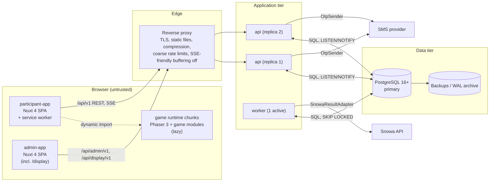
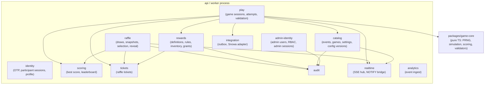

# Container and Component Architecture

## 1. Containers



| Container | Technology (recommended) | Responsibility | Scaling |
|---|---|---|---|
| participant-app | Nuxt 4, Vue 3, TS, client-side rendering, service worker | Auth screens, lobby, pre-game, HUD overlay, result, leaderboard, rewards/profile | Static files; CDN/proxy cache |
| game runtime chunks | Phaser 3 + per-game module | Gameplay rendering/input, deterministic simulation, action log | Lazy per game |
| admin-app | Nuxt 4, Vue 3, TS | Control room, config, raffle, reports, audit, display mode | Static files |
| reverse proxy | Caddy or Nginx | TLS, HTTP/2, static assets, `/api` routing, request size limits, IP rate limits | 1 (+ standby) |
| api | Node.js 22 + TS + Fastify | All synchronous REST, SSE streams, validation, transactions | Stateless, 2+ replicas |
| worker | Same codebase, separate entrypoint | Outbox delivery, session expiry sweeper, reconciliation, scheduled aggregates | 1 active (jobs use row locks, so 2 are safe) |
| PostgreSQL | 16+ | Source of truth, row locking, NOTIFY fan-out | Vertical; replica for backup/HA |

## 2. Backend modules (modular monolith)

Modules communicate through in-process service interfaces; each owns its tables. No module reads another module's tables directly except through the owning module's query functions (enforced by code review and folder boundaries).



| Module | Owns tables | Key operations |
|---|---|---|
| identity | `participants`, `otp_challenges`, `participant_sessions`, `consent_records` | request/verify OTP, session create/revoke, set name |
| catalog | `events`, `games`, `game_settings`, `game_config_versions` | read lobby config, admin toggles, attempt limits |
| play | `game_sessions`, `attempts`, `attempt_payloads`, `attempt_flags` | issue/start/submit/expire sessions, validate |
| scoring | `participant_game_progress` | best-score update, rank queries, leaderboard pages |
| tickets | `raffle_tickets` | grant base ticket, grant reward tickets, void |
| rewards | `reward_definitions`, `reward_rules`, `reward_codes`, `reward_grants` | evaluate rules, allocate inventory, fulfillment |
| raffle | `draws`, `draw_entries`, `draw_winners` | preview, freeze, select, reveal |
| admin-identity | `admin_users`, `admin_sessions`, `display_devices` | login, TOTP, RBAC checks, display tokens |
| audit | `audit_log` | append, query |
| realtime | — (in-memory ring buffer) | publish, subscribe, replay since id |
| integration | `external_deliveries`, `external_delivery_attempts` | enqueue (in caller tx), deliver, retry, replay |
| analytics | `analytics_events` | batch ingest, aggregates |

## 3. Monorepo layout (recommended, for Phase 1)

```text
apps/
  participant/        Nuxt 4 participant SPA
  admin/              Nuxt 4 admin SPA (+ /display routes)
  server/             Fastify API + worker entrypoints
packages/
  contracts/          zod schemas + TS types for REST/SSE payloads (shared)
  game-core/          deterministic PRNG, per-game simulation & scoring, validators (shared, no DOM, no Phaser)
  games/              Phaser scenes per game (client only), depends on game-core
  i18n-fa/            Persian locale files, number/phone/date formatting helpers
  ui/                 shared Vue components + design tokens (RTL-safe)
```

Rationale: `game-core` is imported by **both** the Phaser runtime and the server validator, so the score the client shows and the score the server computes come from the same code ([ADR-010](../11-decisions/ADR-010-score-validation.md)).

## 4. Ownership matrix (what is authoritative where)

| Data / behavior | Authoritative component | Persisted | Cached | Computed |
|---|---|---|---|---|
| Participant identity | identity module / `participants` | yes | session lookup (per request) | — |
| Game enabled/attempt limit | catalog / `game_settings` | yes | in-process 2 s TTL, invalidated by NOTIFY | — |
| Game parameters | `game_config_versions` (immutable) | yes | in-process indefinitely (immutable) | score ceilings computed at load |
| In-game running score | game runtime (display only) | no | — | client |
| Attempt score | play module (server replay) | yes | — | server |
| Best score | scoring / `participant_game_progress` | yes (materialized) | — | recomputable from attempts |
| Rank | scoring (SQL query) | no | leaderboard top-N 1 s | yes |
| Tickets | tickets / `raffle_tickets` | yes | — | counts computed |
| Reward eligibility | rewards module | grants persisted | rule set 2 s | yes |
| Draw winners | raffle module | yes (immutable) | — | once, at execution |
| External delivery state | integration / outbox | yes | — | — |
| Live feeds | realtime hub | no (derived from DB events) | ring buffer 5 min | — |
