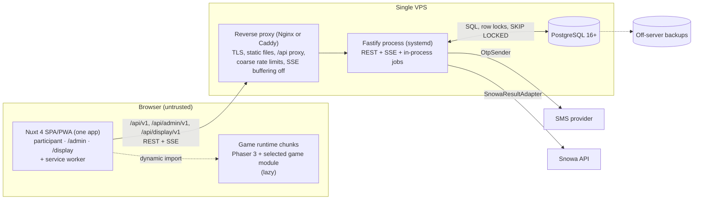
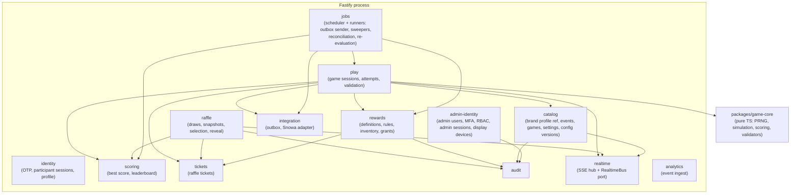

# Container and Component Architecture

v1 runs on one VPS ([Deployment topology](10-deployment-topology.md)). "Container" below means a logical runtime unit (C4 sense), not a Docker container — Docker is not used in v1.

## 1. Runtime units



| Unit | Technology | Responsibility | v1 count |
|---|---|---|---|
| Web app | Nuxt 4, Vue 3, TS, static SPA/PWA | Participant screens; admin control room under `/admin`; booth display under `/display`; route-level code splitting so participants never download admin/display code | 1 build |
| Game runtime chunks | Phaser 3 + per-game module | Gameplay rendering/input, deterministic simulation, action log | lazy per game |
| Reverse proxy | Nginx **or** Caddy | TLS, HTTP/2, static assets, `/api` routing, body limits, IP-level limits, security/robots headers | 1 |
| Fastify process | Node.js 22 + TS | All REST, SSE, validation, transactions, background jobs (outbox sender, sweepers, reconciliation) | 1 |
| PostgreSQL | 16+ | Source of truth, row locking, outbox, rate-limit counters | 1 (same VPS) |

No in-memory state is authoritative: caches, SSE ring buffers and job schedules are recomputable; everything durable is in PostgreSQL.

## 2. Backend modules (modular monolith)

Modules communicate through in-process service interfaces; each owns its tables. No module reads another module's tables directly except through the owning module's query functions (enforced by import lint rules). This boundary discipline is what allows later extraction (scaling stages 4–5) without rewriting domain logic.



| Module | Owns tables | Key operations |
|---|---|---|
| identity | `participants`, `otp_challenges`, `participant_sessions`, `consent_records` | request/verify OTP, session create/revoke, set name |
| catalog | `events`, `games`, `game_settings`, `game_config_versions` | read lobby config, admin toggles, attempt limits, brand profile reference |
| play | `game_sessions`, `attempts`, `attempt_payloads`, `attempt_flags` | issue/start/submit/expire sessions, validate |
| scoring | `participant_game_progress` | best-score update, rank queries, leaderboard pages |
| tickets | `raffle_tickets` | grant base ticket, grant reward tickets, void |
| rewards | `reward_definitions`, `reward_rules`, `reward_codes`, `reward_grants`, `reward_participant_counters` | evaluate rules, allocate inventory, fulfillment |
| raffle | `draws`, `draw_entries`, `draw_winners` | preview, freeze, select, reveal |
| admin-identity | `admin_users`, `admin_sessions`, `display_devices` | login, TOTP, RBAC checks, display tokens |
| audit | `audit_log` | append, query |
| realtime | — (in-memory ring buffer) | publish via `RealtimeBus`, subscribe, replay since id |
| integration | `external_deliveries`, `external_delivery_attempts` | enqueue (in caller tx), deliver, retry, replay |
| analytics | `analytics_events` | batch ingest, aggregates |
| jobs | `job_runs` (optional bookkeeping) | schedule and run background tasks; each task claims rows with locks so it is safe to run in-process now and in a separate worker (or several) later |

## 3. Monorepo layout (for Phase 1)

```text
apps/
  web/                Nuxt 4 SPA/PWA: participant routes, /admin routes, /display routes
  server/             Fastify: api entrypoint (with in-process jobs); optional worker entrypoint later
packages/
  contracts/          zod schemas + TS types for REST/SSE payloads (shared)
  game-core/          deterministic PRNG, per-game simulation & scoring, validators (shared, no DOM, no Phaser)
  games/              Phaser scenes per game (client only), depends on game-core
  i18n-fa/            Persian locale files, number/phone/date formatting helpers
  ui/                 shared Vue components + design tokens (RTL-safe)
brands/
  snowa/              brand profile: logo, theme tokens, Persian copy overrides, game titles, product imagery
```

`game-core` is imported by **both** the Phaser runtime and the server validator, so the score shown by the client and the authoritative score come from the same code ([ADR-010](../11-decisions/ADR-010-score-validation.md)). Brand-specific material lives in `brands/<key>/` and event data, not in platform code ([Reuse & branding](14-reuse-and-branding.md)).

## 4. Ownership matrix (what is authoritative where)

| Data / behavior | Authoritative component | Persisted | Cached | Computed |
|---|---|---|---|---|
| Participant identity | identity module / `participants` | yes | — (indexed lookup per request) | — |
| Game enabled/attempt limit | catalog / `game_settings` | yes | in-process 2 s TTL; always re-read inside session create/start tx | — |
| Game parameters | `game_config_versions` (immutable) | yes | in-process indefinitely (immutable) | score ceilings computed at load |
| In-game running score | game runtime (display only) | no | — | client |
| Attempt score | play module (server replay) | yes | — | server |
| Best score | scoring / `participant_game_progress` | yes (materialized) | — | recomputable from attempts |
| Rank | scoring (SQL query) | no | leaderboard top-N 1 s | yes |
| Tickets | tickets / `raffle_tickets` | yes | — | counts computed |
| Reward eligibility | rewards module | grants persisted | rule set 2 s | yes |
| Draw winners | raffle module | yes (immutable) | — | once, at execution |
| External delivery state | integration / outbox | yes | — | — |
| Live feeds | realtime hub | no (derived from DB events) | ring buffer 5 min | — |
