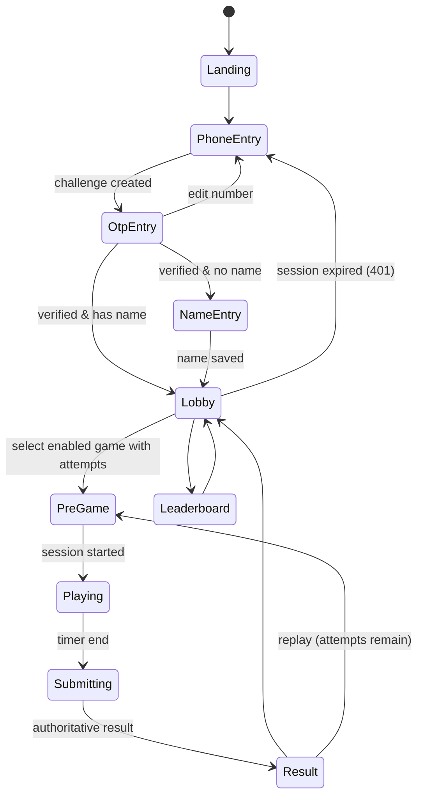
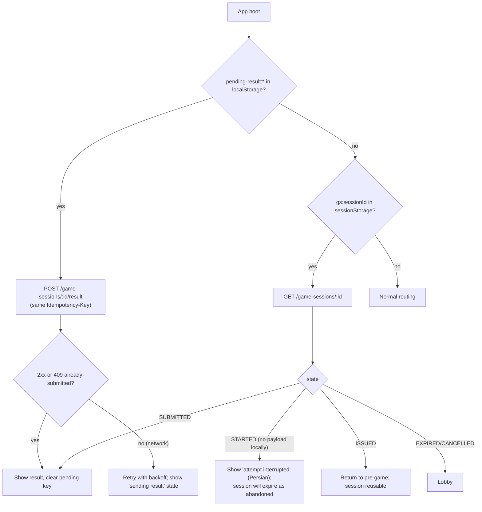

# Client Architecture (Participant App)

## 1. Principles

- Normal web UI (Vue/Nuxt DOM) for everything **outside** gameplay: auth, name, lobby, pre-game instructions, HUD overlay text, result, leaderboard, rewards, profile, errors.
- Phaser owns **only** the gameplay canvas: rendering, input capture, simulation tick, VFX, game audio.
- The client is a **view and input device**. It MUST NOT decide attempts, official score, tickets, rewards, rank or winners.
- Client-side rendering (SPA, `ssr: false`). SSR gives no benefit for an authenticated, QR-launched, mobile game app and adds a server runtime. The HTML shell is static and cacheable.

## 2. Route map

| Route | Screen | Auth | Data source |
|---|---|---|---|
| `/` | Landing (records `src`, CTA to start) | none | static |
| `/login` | Phone entry | none | — |
| `/login/verify` | OTP entry | pending challenge (in memory + `sessionStorage`) | — |
| `/onboarding/name` | First-time name | participant, `display_name = null` | `GET /me` |
| `/lobby` | Lobby | participant with name | `GET /lobby` |
| `/games/:slug` | Pre-game instructions + game host | participant | `GET /lobby` (cached) + `POST /game-sessions` |
| `/games/:slug/result/:sessionId` | Result | participant | `GET /game-sessions/:id` (authoritative result) |
| `/leaderboard/:slug?` | Leaderboard | participant | `GET /leaderboards/:slug` (+ optional SSE while visible) |
| `/me` | Profile: best scores, tickets, rewards | participant | `GET /me/summary` |
| `/rules`, `/faq` | Static Persian content (optional) | none | static |
| `/admin/*` | Admin control room (lazy chunk; see [Admin architecture](06-admin-architecture.md)) | admin session + MFA | `/api/admin/v1/*` |
| `/display/*` | Public booth display (lazy chunk) | display session (read-only) | `/api/display/v1/*` |

Navigation guards (client) mirror server rules only for UX; the server enforces them again (a `401`/`403`/`409` from any call routes the user to the correct step).

## 3. Client state

| State | Where | Lifetime | Notes |
|---|---|---|---|
| Auth session | HttpOnly cookie (not readable by JS) | server-defined | See [Auth](../07-security/02-authentication-and-sessions.md) |
| Profile, lobby snapshot | Pinia store | memory; refetched on focus/route | Never persisted as authority |
| Pending OTP challenge id | `sessionStorage` | until verified | Survives accidental refresh on OTP screen |
| Active game session envelope | memory + `sessionStorage` (`gs:<id>`) | until result shown | Used after refresh to query server state |
| Pending result payload | `localStorage` (`pending-result:<sessionId>`) | until server acknowledges | Enables resubmission after refresh/crash; see §5 |
| Sound on/off | `localStorage` | persistent | UX preference |
| Analytics queue | memory, flushed with `sendBeacon` | short | No PII |

`localStorage`/`sessionStorage` access MUST be wrapped in try/catch (Safari private mode, storage disabled); the app MUST still function (only refresh-recovery degrades).

## 4. Data fetching and consistency

- Single typed API client generated from `packages/contracts` (zod schemas → TS types). Responses are schema-validated in development builds.
- Every mutating call carries `Idempotency-Key` (UUIDv4) generated once per user intent and reused on retries.
- Screens re-fetch authoritative state on: route entry, `visibilitychange → visible`, `online` event, SSE hint.
- Optimistic UI is **not** used for scores, tickets, attempts or rewards.

## 5. Refresh / crash recovery

Gameplay itself is **not resumable** after a page reload (game state lives in memory; resuming would allow "reload until lucky layout" and timer manipulation). This policy is product-approved (OQ-15 resolved).

## 6. Localization (summary)

Root `<html lang="fa" dir="rtl">`. All strings via `packages/i18n-fa`. Numbers/phones/codes rendered through formatting helpers with explicit bidi isolation. Details: [Localization & RTL](11-localization-and-rtl.md).

## 7. Service worker & caching (summary)

App shell precached; per-game assets cached on first use; **API responses never cached by the service worker**. Details: [PWA & mobile](12-pwa-and-mobile.md), [Caching & loading](../10-performance/02-caching-loading-network.md).

## 8. Error UX contract

| API outcome | Client behavior |
|---|---|
| Network error / timeout | Persian retry banner; automatic retry for idempotent requests |
| `401 UNAUTHENTICATED` | Go to `/login`, keep intended route |
| `403 PROFILE_INCOMPLETE` | Go to `/onboarding/name` |
| `409 GAME_UNAVAILABLE` / `ATTEMPTS_EXHAUSTED` | Refresh lobby, show card state |
| `409 SESSION_ALREADY_ACTIVE` | Offer to continue existing ISSUED session or show interrupted STARTED session |
| `429 RATE_LIMITED` | Show cooldown with `retryAfter` countdown |
| `5xx` | Short Persian message + "retry" + "back to lobby" |

All messages are keyed by `error.code` → Persian copy. Raw server messages are never displayed.
