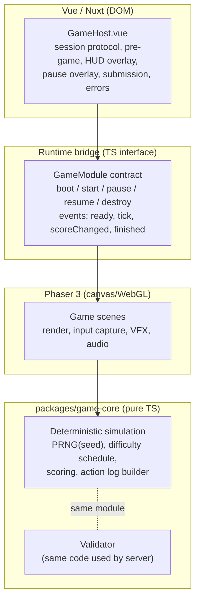
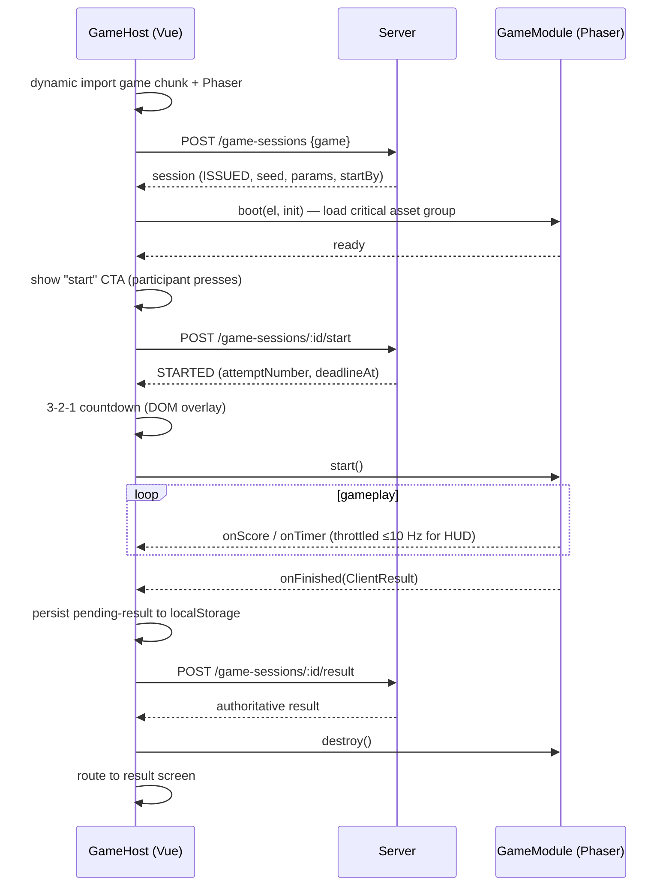

# Game Runtime Architecture

Defines how Phaser gameplay is embedded in the Vue app and how gameplay logic is shared with the server validator. Gameplay rules per game live in `05-games/`.

## 1. Layering



| Layer | Owns | MUST NOT |
|---|---|---|
| GameHost (Vue) | Session lifecycle calls, countdown overlay, HUD text (Persian), pause UI, result submission, retry, navigation | Compute score |
| Phaser scenes | Drawing, touch input capture, animation, audio, haptics triggers | Contain reward/ticket/commercial logic; call backend |
| game-core simulation | Time model, PRNG, spawn/layout generation, classification, scoring, action log | Touch DOM, Phaser, `Math.random`, `Date.now` |
| Server validator | Re-runs game-core on submitted action log | Trust claimed score |

## 2. GameModule contract (illustrative, non-executable)

```ts
// packages/contracts — illustrative shape only
interface GameModule {
  slug: 'spin-perfect' | 'fridge-rush' | 'vision-hunt';
  assetManifest(configVersion: string): AssetManifest;   // groups: critical, deferred, audio
  boot(el: HTMLElement, init: GameInit, events: GameEvents): Promise<void>; // resolves when ready
  start(): void;            // begins countdown-complete gameplay; t=0
  pause(reason: 'user' | 'hidden'): void;
  resume(): void;
  finishEarly(reason: 'pause_budget_exhausted' | 'deadline'): void;
  destroy(): void;          // release textures, sounds, listeners
}
interface GameInit { sessionId: string; seed: string; params: GameParams; durationMs: number;
                     pauseBudgetMs: number; reducedMotion: boolean; soundOn: boolean; }
interface GameEvents { onScore(s: number, combo: number): void; onTimer(msLeft: number): void;
                       onFinished(r: ClientResult): void; onError(e: Error): void; }
interface ClientResult { claimedScore: number; activeMs: number; pausedMs: number;
                         actions: ActionLogEntry[]; runtimeVersion: string; configVersion: string; }
```

## 3. Time model

- Gameplay time `t` (ms, integer) starts at 0 when countdown ends and **only advances while not paused**.
- Input timestamps use `event.timeStamp` (high-resolution, same clock as `performance.now()`), converted to gameplay time by subtracting accumulated paused time. This decouples classification from frame rate (60/90/120 Hz) [SPEC §28].
- The simulation is advanced by fixed logical steps derived from `t`, not by frame count; rendering interpolates. Scoring depends on `t` and inputs only.
- All scoring math uses **integers** (ms, integer phase units, per-mille multipliers). No trigonometry or floating-point accumulation in scoring paths, because JavaScriptCore (iOS) and V8 (server) may differ in last-bit float results.

## 4. Determinism

| Element | Source |
|---|---|
| Random layouts/sequences | `prng = createPrng(seed)` (e.g., `sfc32`/`xoshiro128**`) in game-core; seed from server per session |
| Difficulty schedule | `params` of the session's `game_config_version` |
| Cosmetic randomness (particles, shake) | Separate non-seeded RNG; MUST NOT affect scoring |

Given `(configVersion, seed, actions)`, game-core returns identical `(score, stats)` on client and server.

## 5. Lifecycle inside GameHost



Rationale for calling `/start` **after** assets are ready and the participant presses start: a slow network or a server error before gameplay never consumes an attempt [SPEC §8.2].

## 6. HUD and text rendering

- Timer, score, combo labels and pause/instruction text are DOM overlays positioned over the canvas: correct Persian shaping, font consistency, accessibility, easy RTL.
- In-canvas feedback words (e.g., Persian "عالی!") are pre-rendered bitmap textures from the locale pack at build time, avoiding runtime canvas text shaping issues.
- HUD updates are throttled (timer 10 Hz, score on change) to avoid DOM thrash.

## 7. Memory and teardown

`destroy()` MUST remove the Phaser game instance (`game.destroy(true)`), unload game-specific textures/audio from caches, detach listeners (`visibilitychange`, `pagehide`, pointer). Switching between the three games repeatedly MUST NOT grow memory (tested in [Performance testing](../08-quality/04-load-and-resilience-testing.md)).

## 8. What can change without deployment

| Change | Live (admin) | Requires new config version | Requires deployment |
|---|---|---|---|
| Game enabled/disabled, emergency stop | ✓ | | |
| Attempt limit | ✓ | | |
| Rewards on a game | ✓ | | |
| Durations, windows, point tables, difficulty | | ✓ (published by Super Admin between event days, not live during play) | ✓ if new params need code |
| Mechanics, art, scenes | | | ✓ |
