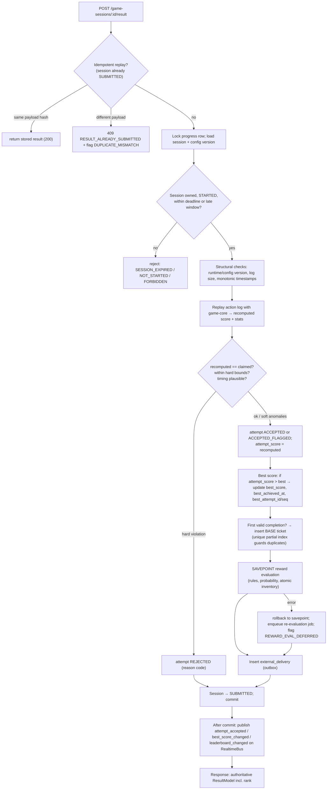

# Backend Architecture

Technology decision: [ADR-002](../11-decisions/ADR-002-backend-technology.md) (**Accepted**: Node.js 22 + TypeScript + Fastify + PostgreSQL 16+). Deployment: one Fastify process on one VPS ([Deployment topology](10-deployment-topology.md)).

## 1. Process model

| Process (v1) | Entrypoint | Runs | Count |
|---|---|---|---|
| `api` | `server/main.ts` | HTTP REST, SSE streams, **in-process `jobs` module** (outbox sender, sweepers, reconciliation) | 1, supervised by `systemd` |
| `migrate` | `server/migrate.ts` | Schema migrations (one-shot, before restart) | job |
| `worker` (future, scaling stage 4) | `server/worker.ts` | Same `jobs` module without HTTP; API started with `JOBS_ENABLED=false` | 0 in v1 |

Background jobs are a separate backend module with its own scheduler and runners. They never call HTTP handlers and domain modules never depend on them, so moving them to a dedicated worker process is a configuration/entrypoint change, not a rewrite. Every job claims work with transactions and row locks (`FOR UPDATE SKIP LOCKED`) or a PostgreSQL advisory lock for singleton tasks, so running zero, one or several job runners is always safe.

Graceful shutdown (`SIGTERM` from systemd): stop accepting connections, close SSE streams with a `retry` hint, let in-flight requests finish (≤ 10 s), stop job runners after their current item; any delivery left `IN_FLIGHT` is recovered by lease expiry after restart.

No in-memory state is authoritative. Anything lost on restart is either recomputable (caches, SSE ring buffer) or durable in PostgreSQL.

## 2. Request pipeline

```mermaid
flowchart LR
  REQ["HTTP request"] --> RID["request id + structured log context"]
  RID --> SZ["size limit (body ≤ 64 KB; result ≤ 128 KB)"]
  SZ --> AUTHN["authenticate<br/>(participant cookie / admin cookie / display token)"]
  AUTHN --> RL["rate limit (per phone / session / IP class)"]
  RL --> VAL["schema validation (zod, shared contracts)"]
  VAL --> AUTHZ["authorize (ownership / RBAC permission)"]
  AUTHZ --> IDEM["idempotency check (for mutating endpoints)"]
  IDEM --> H["handler → module service"]
  H --> TX[("single DB transaction per command")]
  TX --> POST["after-commit: publish realtime hints, metrics"]
  POST --> RES["response (typed, no internal details)"]
```

## 3. Transaction boundaries (critical commands)

| Command | One transaction contains | Locks |
|---|---|---|
| Verify OTP | challenge consume, participant upsert, session insert, audit (first login) | challenge row |
| Create game session | settings read, open-session check, session insert | `participant_game_progress` row (`FOR UPDATE`) |
| Start session | attempt-limit check, attempt insert (`attempt_number`), progress `attempts_used++`, session → STARTED | progress row |
| Submit result | attempt validation outcome, payload insert, flags, best-score update, base ticket (unique), reward evaluation (savepoint), outbox insert, analytics insert | progress row; reward rule rows / codes (`SKIP LOCKED`) |
| Execute draw | draw state transition, snapshot insert, winner insert, audit | draw row (`FOR UPDATE`) |
| Admin config change | settings update (optimistic `version` check), audit | settings row |

Realtime publications and non-critical side effects occur **after commit**; if the process dies between commit and publish, clients recover by re-fetch (hints are not authoritative).

## 4. Result-acceptance pipeline

The heart of the system. Executed inside the submit transaction unless noted.

Rank in the response is computed after commit with a single indexed query (see [Leaderboard rules](../02-domain/04-best-score-and-leaderboard.md)).

## 5. Configuration and caching

| Item | Source | Cache | Invalidation |
|---|---|---|---|
| `game_settings` | DB | per-process, 2 s TTL | `config_changed` event on RealtimeBus clears immediately |
| `game_config_versions` | DB | per-process, forever | immutable |
| `reward_rules` (active) | DB | per-process, 2 s TTL | `rewards_changed` event on RealtimeBus |
| Leaderboard top-N | DB query | per-process per game, 1 s | time-based; SSE hints throttled to 1/s |
| Participant session | DB | none (single indexed lookup) | — |

Attempt-limit and availability checks at session **creation/start** always read the DB row inside the transaction (never cache-only), so admin changes apply immediately to new sessions [SPEC §16.2].

## 6. Background jobs (`jobs` module, in-process in v1)

| Job | Trigger | Behavior |
|---|---|---|
| `outbox.deliver` | loop, 1 s idle poll + in-process wake-up after commit | claim `PENDING`/`RETRY_SCHEDULED` rows due now, `SKIP LOCKED`, batch ≤ 20, call adapter, record attempt |
| `sessions.expire` | every 15 s | ISSUED past `start_by` → `EXPIRED` (no attempt); STARTED past `late_deadline_at` → attempt `ABANDONED`, session `EXPIRED` |
| `rewards.reevaluate` | queue rows | re-run reward evaluation for attempts flagged `REWARD_EVAL_DEFERRED` (idempotent via grant unique keys) |
| `integrity.reconcile` | every 10 min + on demand | verify `best_score` equals max of valid attempts; verify base tickets vs first valid completions; report mismatches (no auto-fix without admin) |
| `metrics.aggregate` | every 10 s | dashboard counters (participants, active players, attempts per game) into memory + SSE |
| `retention.purge` | daily (disabled until OQ-13 answered) | apply retention policy |

## 7. Failure behavior summary

| Failure | Behavior |
|---|---|
| Fastify process crash / restart | systemd restarts it within seconds (`Restart=always`); in-flight requests fail and are retried by clients with the same idempotency key; SSE clients reconnect and re-fetch; committed transactions and outbox rows are unaffected |
| DB transient error (serialization/connection) | Retry transaction up to 3× with jitter inside handler; then `503 RETRYABLE` → client retries |
| DB down | `503`; participant sees retry state; pending result stays in `localStorage`; late-submission window covers short outages |
| Jobs stalled (bug, disabled) | Outbox backlog grows and is visible in admin; expiry sweeps pause (sessions are also lazily expired when touched); nothing accepted is lost |
| Clock skew (host vs DB, future multi-instance) | All server timestamps come from PostgreSQL `now()`/`clock_timestamp()` inside transactions, not from app hosts |
