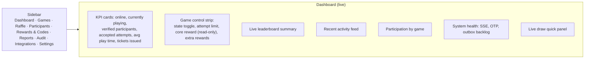
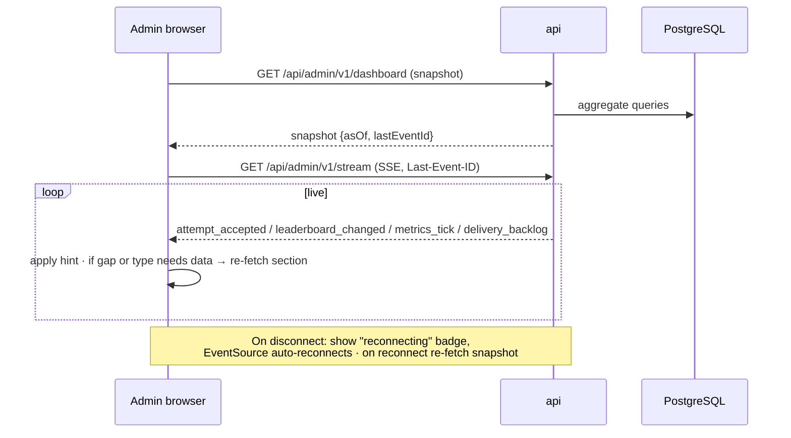

# Admin Architecture

Functional detail is in `06-admin/`. This document covers structure, deployment and runtime behavior.

## 1. Placement

| Decision | v1 choice | Why |
|---|---|---|
| App | `/admin` routes inside the single Nuxt app, lazily loaded as their own chunk | One build/deployment; participants never download admin code |
| Public display | `/display/*` routes of the same app, authenticated by a display token | Shares leaderboard/draw components; never admin permissions |
| Origin | Same origin as the participant app (`https://snowa-games.osameh.dev` on staging) | Simple; security comes from server-side authorization, not from URL secrecy |
| API namespace | `/api/admin/v1/*`, `/api/display/v1/*` | Distinct auth middleware, cookies and rate limits |
| Language | Persian/RTL (SPEC §5); bilingual optional (OQ-11) | Same i18n package |

## 1a. Admin security baseline (non-negotiable)

The admin area is **not** protected by being hidden. Every admin API call is authorized on the server.

| Control | Requirement |
|---|---|
| Identity namespace | Separate `admin_users` / `admin_sessions`; cookie `sx_as` (`HttpOnly; Secure; SameSite=Strict; Path=/api/admin`) — distinct from participant `sx_ps` and display `sx_ds` |
| Accounts | Local named accounts in v1 (OQ-21 resolved); no shared logins |
| Passwords | Argon2id |
| MFA | Mandatory TOTP for every admin role |
| Step-up | Fresh TOTP (≤ 5 min) for T4 operations: execute/void draw, manual ticket grant/void, invalidate/restore attempt, activate unlimited or changed active reward rules, bulk export, participant erase ([Operator safety UX](../06-admin/07-operator-safety-ux.md)) |
| CSRF / Origin | `SameSite=Strict`, required `X-Requested-With` header, `Origin` must equal the deployment origin on every mutating request |
| Brute force | Per-username and per-IP login limits, lockout, alerts |
| Revocation | Super Admin can disable accounts and revoke all sessions immediately |
| RBAC | Permission checked per endpoint on the server ([Roles](../06-admin/02-roles-and-permissions.md)); Vue hides buttons only for UX |
| Cross-namespace | Participant and display sessions are **rejected** by admin middleware; admin middleware never accepts `sx_ps`/`sx_ds`; display sessions never gain admin permissions |
| Audit | Every admin mutation and every login/MFA event audited ([Audit model](../02-domain/08-audit-model.md)) |
| Robots | `/admin/*` and `/display/*` responses carry `X-Robots-Tag: noindex, nofollow, noarchive` and a matching `<meta name="robots">`; excluded in `robots.txt` (not a security control) |
| Same-origin XSS risk | Because admin and participant routes share an origin, an XSS bug in any route could call admin APIs from an admin's browser. Mitigations: strict CSP (self-only scripts, no inline), no `v-html` with untrusted content, cookie `Path` scoping, step-up TOTP for T4 actions, and operators SHOULD use a dedicated browser profile for admin work. Moving admin to its own subdomain is a documented future hardening option |

## 1b. Optional network hardening (defense in depth only)

Core admin security MUST NOT depend on these, because exhibition connectivity changes:

- Reverse-proxy IP allowlist for `/admin` and `/api/admin` when booth/operator IPs are predictable.
- VPN or private network access to the admin paths if operationally practical.
- Additional reverse-proxy authentication (e.g., HTTP basic auth) in front of the whole staging site or `/admin` on staging.

## 2. Control-room layout (from SPEC §16 and concept CA-09)

## 3. Live data flow

- Dashboard sections re-fetch at most once per second each (coalesced) on hints.
- Charts keep bounded series (e.g., last 120 points) to avoid memory growth over hours [SPEC §27].
- Every section displays `asOf` time; stale > 10 s shows a stale badge.

## 4. Command safety model

All state-changing admin requests:

1. Carry `Idempotency-Key` (prevents double-click duplicates).
2. Carry the entity `version` read by the UI (optimistic concurrency → `409 VERSION_CONFLICT` if another admin changed it).
3. Require a confirmation UX proportional to risk ([Operator safety UX](../06-admin/07-operator-safety-ux.md)).
4. Require a `reason` for high-risk actions (manual score/ticket changes, emergency stop, draw re-run, attempt invalidation).
5. Write an `audit_log` row in the same transaction.

## 5. Public display runtime

| Aspect | Behavior |
|---|---|
| Auth | Display token (random 256-bit) created by Admin, shown once as a URL/QR; exchanged for an HttpOnly display cookie; revocable |
| Mode | Controlled by admin: `leaderboard:<game>`, `rotate`, `draw:<drawId>`, `idle` — persisted in `display_devices.mode` and pushed via SSE |
| Data | Masked/public projection only; never phone numbers |
| Resilience | Auto-reconnect; on reconnect re-fetch current mode + data; "stale/reconnecting" indicator after 5 s without heartbeat [SPEC §14.2] |
| Long-running | Full page reload scheduled nightly or when a new app build hash is detected between draws (never during a reveal) |
| Motion | Rank changes animate at most every 2 s with stable transitions [SPEC §14.2] |
