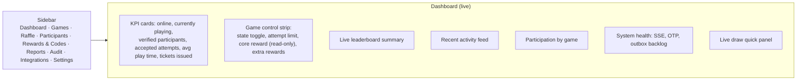
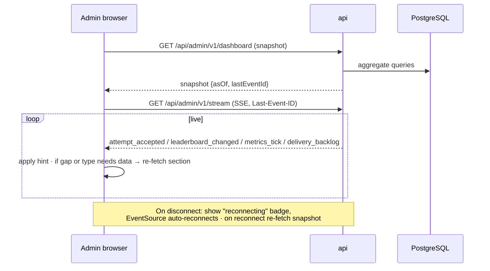

# Admin Architecture

Functional detail is in `06-admin/`. This document covers structure, deployment and runtime behavior.

## 1. Placement

| Decision | Recommendation | Why |
|---|---|---|
| Separate app | `apps/admin` separate Nuxt SPA from `apps/participant` | Participant bundle stays small; admin can live on a separate origin with IP allowlisting and separate cookies |
| Origin | `admin.<domain>` (OQ-27) | Cookie isolation; WAF/allowlist per origin; no admin code shipped to phones |
| Public display | Route `/display/:displayId` inside admin app, authenticated by display token | Shares leaderboard/draw components; no admin permissions |
| API namespace | `/api/admin/v1/*`, `/api/display/v1/*` | Distinct auth middleware and rate limits |
| Language | Persian/RTL (SPEC §5); bilingual optional (OQ-11) | Same i18n package as participant app |

## 2. Control-room layout (from SPEC §16 and concept CA-09)

## 3. Live data flow

- Dashboard sections re-fetch at most once per second each (coalesced) on hints.
- Charts keep bounded series (e.g., last 120 points) to avoid memory growth over hours [SPEC §27].
- Every section displays `asOf` time; stale > 10 s shows a stale badge.

## 4. Command safety model

All state-changing admin requests:

1. Carry `Idempotency-Key` (prevents double-click duplicates).
2. Carry the entity `version` read by the UI (optimistic concurrency → `409 VERSION_CONFLICT` if another admin changed it).
3. Require a confirmation UX proportional to risk ([Operator safety UX](../06-admin/07-operator-safety-ux.md)).
4. Require a `reason` for high-risk actions (manual score/ticket changes, emergency stop, draw re-run, attempt invalidation).
5. Write an `audit_log` row in the same transaction.

## 5. Public display runtime

| Aspect | Behavior |
|---|---|
| Auth | Display token (random 256-bit) created by Admin, shown once as a URL/QR; exchanged for an HttpOnly display cookie; revocable |
| Mode | Controlled by admin: `leaderboard:<game>`, `rotate`, `draw:<drawId>`, `idle` — persisted in `display_devices.mode` and pushed via SSE |
| Data | Masked/public projection only; never phone numbers |
| Resilience | Auto-reconnect; on reconnect re-fetch current mode + data; "stale/reconnecting" indicator after 5 s without heartbeat [SPEC §14.2] |
| Long-running | Full page reload scheduled nightly or when a new app build hash is detected between draws (never during a reveal) |
| Motion | Rank changes animate at most every 2 s with stable transitions [SPEC §14.2] |
