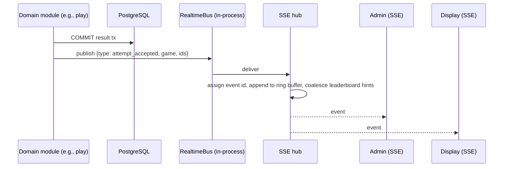

# Real-Time Architecture

Decision record: [ADR-003](../11-decisions/ADR-003-realtime-transport.md). Event contracts: [Real-time events](../04-api/07-realtime-events.md).

## 1. Principle

Real-time messages are **hints**; PostgreSQL is authoritative [SPEC §19.2]. Every real-time consumer has a REST snapshot endpoint and MUST be able to recover purely by re-fetching.

## 2. Transport choice

| Channel | Consumers | Transport | Reason |
|---|---|---|---|
| Admin stream | Admin dashboard, live scores, raffle console | SSE | One-way server→client; commands go over REST |
| Display stream | Public booth screens | SSE | One-way; auto-reconnect built into `EventSource` |
| Leaderboard stream | Participant leaderboard screen (only while visible) | SSE, closed on `visibilitychange: hidden` | Avoid persistent connections on phones |
| Participant lobby/result | Participants | REST fetch on demand | Rank is shown on result response and lobby load; no stream needed |
| Fallback | Any SSE consumer | Poll snapshot every 5–10 s after 3 failed reconnects | Proxies/networks that break streaming |

WebSocket is not selected: no client→server streaming requirement exists, and SSE works over plain HTTP/1.1 and HTTP/2 with standard proxies, cookies and auth, with less operational surface.

## 3. Event flow in v1 (single Fastify process)

Domain modules publish through a `RealtimeBus` port **after commit**. In v1 the bus is an in-process event emitter; SSE runs in the same Fastify process. No Redis, no WebSocket infrastructure.

- Payloads are small (< 1 KB) and contain ids, not PII.
- The hub keeps a **5-minute ring buffer** per channel to serve `Last-Event-ID` resumption. Event ids are `<epochMs>-<seq>`; if the id is older than the buffer or unknown (e.g., after a process restart), the server sends a `resync` event and the client re-fetches the snapshot.
- `leaderboard_changed` is **coalesced**: at most one per game per second.
- Heartbeat comment (`: ping`) every 15 s keeps proxies and mobile NAT alive; clients treat 35 s without data as disconnected.
- If the process dies between commit and publish, hints are lost but clients recover through `resync`/snapshot re-fetch — hints are never authoritative.

### Future: multiple Fastify instances (scaling stage 5)

Swap the `RealtimeBus` adapter to PostgreSQL `LISTEN/NOTIFY` (already available, no new infrastructure): each instance publishes with `NOTIFY rt, '<json>'` (≤ 8000 bytes) and every instance's listener feeds its own hub. Clients reconnecting to a different instance receive `resync`. Redis pub/sub is considered only if NOTIFY throughput is measured to be insufficient (stage 6).

## 4. Connection budget

| Consumer | Expected connections (A-01) | Notes |
|---|---|---|
| Admin/operator | ≤ 20 | |
| Displays | ≤ 10 | |
| Participant leaderboard viewers | ≤ 500 concurrent peak | Only while leaderboard screen visible |

A single Node.js process handles thousands of idle SSE connections; the constraint is proxy configuration (`proxy_buffering off`, read timeout ≥ 60 s, HTTP/2 to avoid the 6-connections-per-origin limit of HTTP/1.1).

## 5. Behavior under failure

| Failure | Consumer sees | Recovery |
|---|---|---|
| Stream drop | "reconnecting" badge after 5 s | `EventSource` retry (server sends `retry: 3000`); snapshot re-fetch on reconnect |
| Fastify restart (deploy/crash) | Drop; reconnect within seconds after systemd restart | `resync` (ring buffer empty) → snapshot |
| (stage 5 only) NOTIFY listener lost DB connection | Instance stops receiving hints | Listener reconnects and emits `resync` to its clients |
| DB down | Snapshot fetch fails | Displays keep last data with explicit **stale** banner; never present stale data as live |
| Draw reveal during disconnect | Display misses reveal events | Reveal state (`revealed_count`) is persisted; on reconnect the display renders the persisted state |
