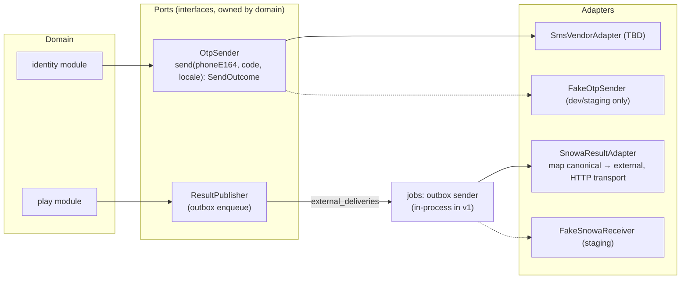
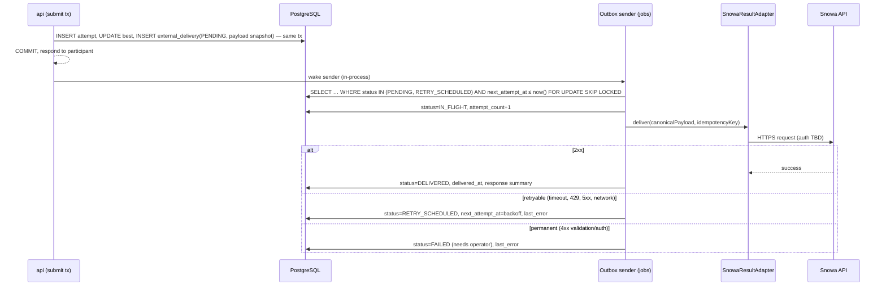

# Integration Architecture

Two outbound integrations exist: the **OTP/SMS provider** (synchronous, on the login path) and the **Snowa External API** (asynchronous, after results). Both sit behind adapters so vendor/contract changes do not touch domain code.

## 1. Adapter boundaries

| Port | Sync/async | Failure isolation |
|---|---|---|
| `OtpSender` | Synchronous call with 5 s timeout during `POST /auth/otp/request` | Failure → challenge marked `SEND_FAILED`, participant sees retry; no challenge code leaked |
| `ResultPublisher` → `ExternalResultAdapter` (`SnowaResultAdapter` for this brand) | Asynchronous via transactional outbox | External outage never blocks result response [SPEC §17.2] |

## 2. Snowa result delivery flow

Full contract, idempotency, retry schedule and reconciliation: [External Snowa adapter contract](../04-api/08-external-snowa-adapter.md).

## 3. Canonical internal result model (adapter input)

Stored in `external_deliveries.payload` at enqueue time (snapshot; later changes do not mutate it):

| Field | Type | Notes |
|---|---|---|
| `delivery_id` | UUID | Also the idempotency key candidate |
| `event_id` | UUID | |
| `participant_id` | UUID | Internal only |
| `phone_e164` | string | `+989123456789`; adapter formats (e.g., `09123456789` per SPEC example) |
| `display_name` | string | Sent only if the final contract requires it (OQ-04) |
| `game_slug` | string | `spin-perfect` |
| `game_external_id` | string/int | Mapping TBD (SPEC example shows `1`) |
| `attempt_id` | UUID | |
| `attempt_number` | int | |
| `attempt_score` | int | |
| `best_score` | int | Default value sent as `score` [SPEC §17.3] |
| `is_new_best` | bool | |
| `accepted_at` | timestamp (UTC) | |

## 4. Operational visibility

Admin → Integrations shows counts by status, oldest pending age, last success time, error categories, per-participant delivery history, and actions: retry now, retry all failed (Super Admin), mark as resolved-manually (with reason). See [Admin integrations](../06-admin/05-live-operations.md#5-external-api-delivery-monitoring).
