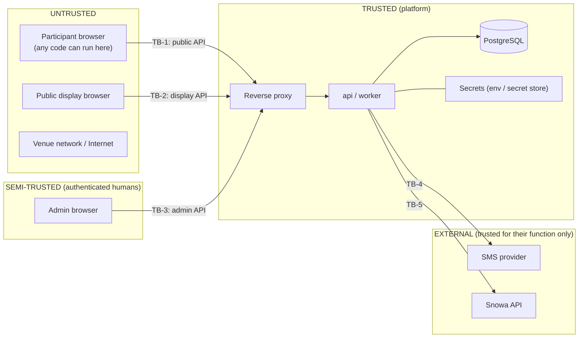

# Trust Boundaries

## 1. Boundary diagram

## 2. Boundary rules

| Boundary | Crossing data | Rules |
|---|---|---|
| TB-1 Participant → API | phone, OTP code, name, session commands, action logs, analytics events | Every field schema-validated; ownership checks on every session id; claimed scores never trusted; rate-limited; body size-limited |
| TB-2 Display → API | display token, read requests | Read-only projection; no PII beyond public display name policy |
| TB-3 Admin → API | config changes, draw commands, exports | Strong auth (password + TOTP), RBAC per endpoint, idempotency, audit, optional IP allowlist |
| TB-4 API → SMS | phone, OTP text | Only the SMS text leaves; credentials server-side only |
| TB-5 Worker → Snowa | agreed result payload | Only fields in the approved contract; credentials server-side only |

## 3. What the client can and cannot influence

| Client CAN | Client CANNOT |
|---|---|
| Choose which enabled game to start | Start a disabled game or exceed attempt limit |
| Produce inputs (taps, drags) and their timing | Set the seed, config version, attempt number, or start time |
| Report a claimed score | Have a claimed score accepted unless it equals the server's recomputation from the action log, within bounds |
| Retry the same submission | Create additional attempts, tickets or rewards by retrying |
| Close/reload the browser | Get a fresh attempt without consuming one after start |
| Watch animations of a draw | Influence or pre-learn winners (display receives winners only after persistence) |
| Fabricate a plausible action log (bot) | Exceed physically plausible bounds without being flagged/rejected (see [Anti-cheat](../07-security/03-anti-cheat-and-score-integrity.md)) |

## 4. Residual risk statement

A determined attacker who reverse-engineers game-core can script **plausible** high scores (e.g., near-perfect timing). The design makes this detectable (statistical flags, admin review, invalidation with audit) but not impossible. This is accepted for an exhibition campaign; the mitigation is operational review of top-ranked attempts before prizes tied to ranks are awarded.
