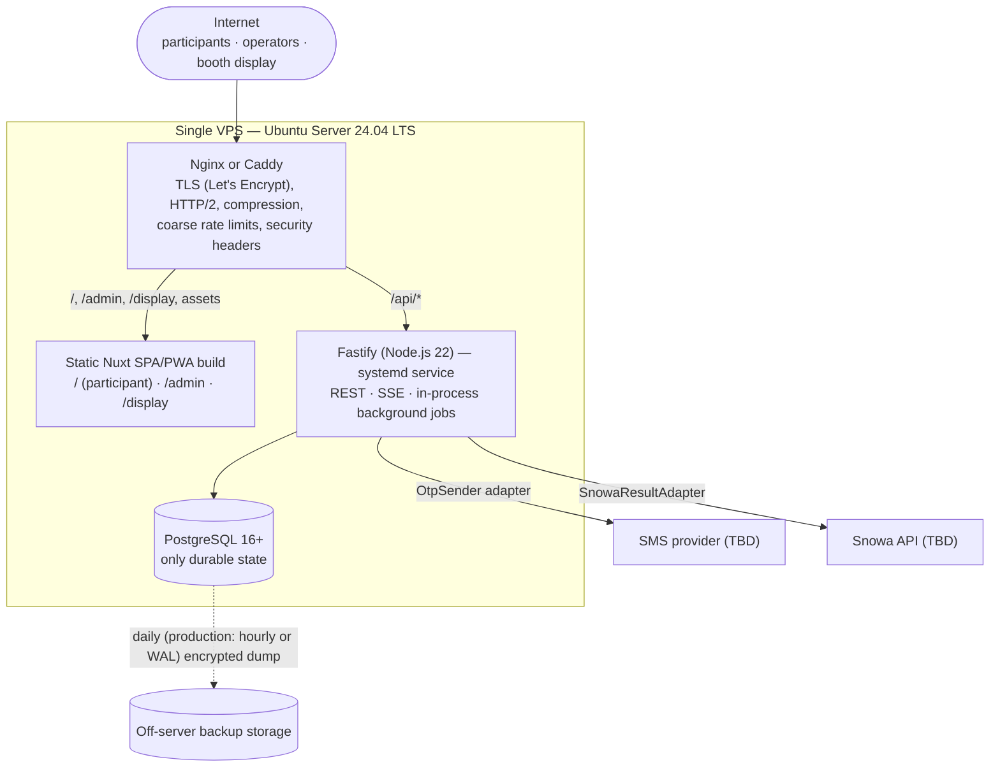
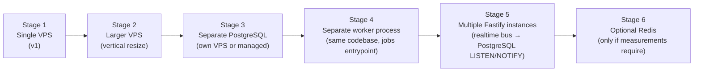

# Deployment Topology

Decision record: [ADR-012](../11-decisions/ADR-012-deployment-topology.md) (**Accepted**). Principle: a temporary exhibition deployment must be **operationally simple and inexpensive** without weakening score integrity, security, auditability or result durability. Simplification applies to infrastructure only — never to the security or integrity model.

## 1. v1 topology (staging and exhibition production)

One VPS running one reverse proxy, one static Nuxt build, one Fastify process and one PostgreSQL instance. No Docker, no Redis, no Kubernetes, no message broker, no separate worker, no separate frontend deployments.

| Component | v1 form | Notes |
|---|---|---|
| Reverse proxy | Nginx or Caddy (one of them) | TLS via Let's Encrypt, serves static files, proxies `/api` with streaming enabled for SSE |
| Frontend | One Nuxt 4 application built as static SPA/PWA files | No always-running Nuxt server; `/admin` and `/display` are routes of the same app, code-split |
| Backend | One Fastify process under `systemd` | Owns all domain logic, SSE and background jobs |
| Database | PostgreSQL 16+ on the same VPS | Only durable/stateful service |
| Backups | Off-server, encrypted | Daily minimum; see [Backup & recovery](../09-operations/06-backup-recovery-and-reconciliation.md) |

## 2. Server baselines

| | Staging | Exhibition production (starting point) |
|---|---|---|
| Hostname | `https://snowa-games.osameh.dev` | TBD (OQ-27, non-blocking) |
| OS | Ubuntu Server 24.04 LTS | Ubuntu Server 24.04 LTS |
| CPU / RAM | 1 vCPU / 2 GB + ~2 GB swap | 2 vCPU / 4 GB (+ swap) |
| Disk | 25–30 GB SSD/NVMe | 40–50 GB SSD/NVMe |
| Network | Static public IPv4, ≥ ~100 Mbps | Static public IPv4, ≥ ~100 Mbps (measure) |
| Location | Prefer geographically close to Iranian exhibition users | Same |
| Runtime | Node.js 22, PostgreSQL 16+, Nginx or Caddy | Same |
| Vendor | TBD (not a Phase 1 blocker) | TBD |

Both are **starting** sizes. VPSs must be vertically resizable. Final production sizing is decided from Phase 1/7 load-test evidence ([Load testing](../08-quality/04-load-and-resilience-testing.md)); the assumed scale (A-01) alone does not justify larger servers.

Memory plan for the 2 GB staging VPS (indicative): PostgreSQL `shared_buffers` 256 MB, `max_connections` 40; Node heap limit ~512 MB (`--max-old-space-size`); proxy and OS remainder. Builds run in CI, never on the VPS.

## 3. Request routing

| Path | Served by | Auth namespace |
|---|---|---|
| `/`, `/lobby`, `/games/*`, … | static SPA (participant routes) | participant cookie `sx_ps` |
| `/admin/*` | static SPA (admin routes, lazy chunk) + `X-Robots-Tag: noindex, nofollow, noarchive` | admin cookie `sx_as` |
| `/display/*` | static SPA (display routes) + `X-Robots-Tag: noindex, nofollow, noarchive` | display cookie `sx_ds` |
| `/api/v1/*` | Fastify | participant |
| `/api/admin/v1/*` | Fastify | admin (MFA) |
| `/api/display/v1/*` | Fastify | display (read-only) |
| `/healthz`, `/readyz` | Fastify (proxy may restrict to localhost/monitor) | none |
| `/metrics` | Fastify, **not** proxied publicly | local only |

A single origin avoids CORS and third-party-cookie issues. Namespace separation is enforced by the server (distinct cookies, cookie `Path` scoping, per-namespace auth middleware), never by hiding routes. See [Admin architecture](06-admin-architecture.md) and [Authentication](../07-security/02-authentication-and-sessions.md).

## 4. Network constraints (A-05)

- If the platform is served to users in Iran, foreign CDNs, font services, analytics and error-tracking SaaS may be unreachable or slow. **All runtime dependencies MUST be self-hosted** on the VPS (fonts, Phaser, icons). No third-party origins in production pages.
- Venue mobile networks congest under crowds. Keep the app shell small, enable HTTP/2, long-lived immutable caching for hashed assets; consider booth Wi-Fi (operations decision).

## 5. Incremental scaling path (future options, not v1 requirements)

Each stage is triggered only by measurement (load tests or production metrics) and requires no architectural replacement, because module boundaries, the PostgreSQL outbox, `SKIP LOCKED` job claiming and the realtime bus interface are designed for it from v1.

| Stage | Trigger (measured) | Change | Code impact |
|---|---|---|---|
| 1 | — | Single VPS | — |
| 2 | CPU > 70 % or memory pressure at target load | Resize VPS (e.g., 2→4 vCPU) | None |
| 3 | DB contention with app CPU; need for managed backups/PITR/HA | Move PostgreSQL to its own server or a managed service | Connection string only |
| 4 | Background jobs affect request latency | Run `jobs` module via a second entrypoint (`server/worker.ts`); disable in-process jobs in API via config | Config + entrypoint; domain logic unchanged |
| 5 | One process cannot serve load / need zero-downtime deploys | Several Fastify instances behind the proxy; switch `RealtimeBus` from in-process to PostgreSQL `LISTEN/NOTIFY`; rate-limit counters already in PostgreSQL | Adapter swap |
| 6 | PostgreSQL-based rate limits / pub-sub / ranks become the bottleneck | Redis for rate limits, top-N caches, pub/sub or ZSET ranks | Adapter additions |
