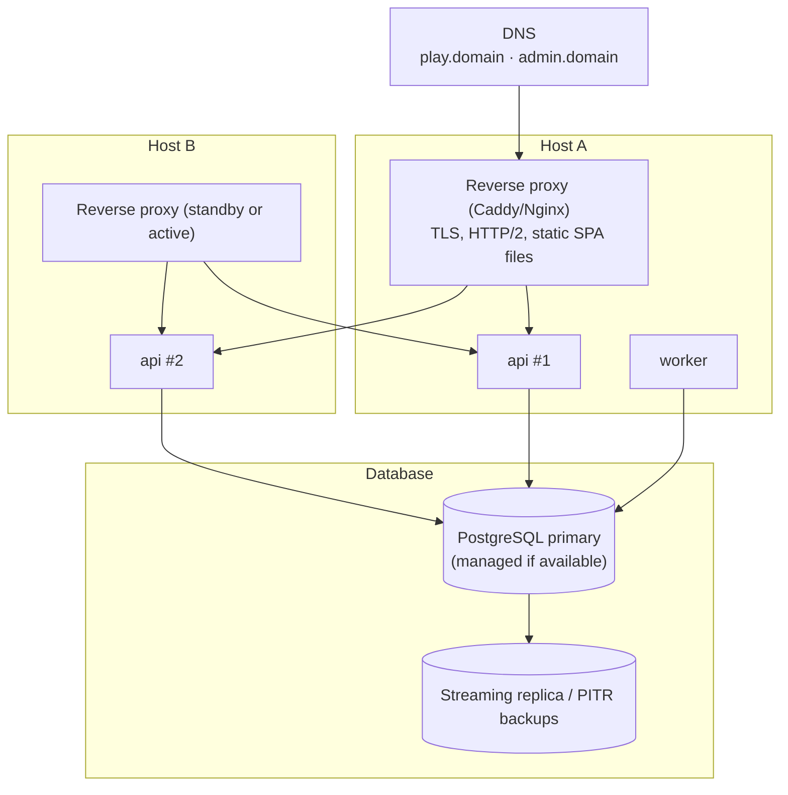

# Deployment Topology

Decision record: [ADR-012](../11-decisions/ADR-012-deployment-topology.md). Hosting provider and region are **open** (OQ-02). This topology is provider-neutral.

## 1. Production / event topology (recommended)

| Element | Minimum for event | Notes |
|---|---|---|
| API | 2 replicas, 2 vCPU / 2 GB each | Stateless; rolling restart safe |
| Worker | 1 | Can co-locate |
| PostgreSQL | 4 vCPU / 8 GB, SSD, PITR | Managed service preferred; otherwise primary + replica + WAL archiving |
| Proxy | 1 active (+1 standby) | Static files served here; CDN optional |
| Containers | Docker images, Compose or equivalent | Kubernetes not required at this scale |

## 2. Network constraints (A-05)

- If the platform is hosted/served in Iran, foreign CDNs, font services, analytics and error-tracking SaaS may be unreachable or slow. **All runtime dependencies MUST be self-hosted** (fonts, Phaser, icons, error tracking). No `<script>`/`<link>` to third-party origins in production.
- Venue mobile networks congest under crowds. Keep the app shell small, enable HTTP/2, long-lived immutable caching for hashed assets, and consider booth Wi-Fi with a captive-portal-free SSID (operations decision).

## 3. Domains

| Origin | Serves | Cookie |
|---|---|---|
| `play.<domain>` | participant SPA + `/api/v1/*` (proxied to api) | `sx_ps` participant session |
| `admin.<domain>` | admin SPA + display routes + `/api/admin/v1/*`, `/api/display/v1/*` | `sx_as` admin session, `sx_ds` display session |

Same-origin API (via proxy path) avoids CORS and third-party-cookie restrictions (important on iOS Safari ITP).
