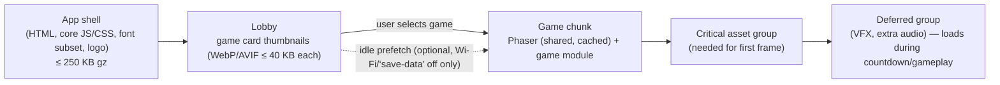

# PWA and Mobile Behavior

Primary target: mobile portrait. Tablet portrait fully supported. Installation optional, never required [SPEC PD-01, §20].

## 1. Viewport targets

| Class | Reference sizes (CSS px) | Priority | Layout rule |
|---|---|---|---|
| Small phone | 360×640 | Must work | Game canvas scales to fit; HUD compact; no clipped Persian text |
| Phone | 360×800, 390×844, 430×932 | Highest | Design baseline |
| Tablet portrait | 768×1024, 820×1180, 834×1194 | High | Centered game stage, max width ~600 px for UI columns; canvas scales up to stage |
| Landscape (phone/tablet) | — | Medium | UI works; gameplay shows "rotate device" overlay on phones in landscape (Persian); tablets letterbox portrait stage |
| Desktop | — | Admin/display/QA | Participant flow functional with centered phone-width column |

Game stage: fixed logical resolution (e.g., 720×1280 portrait) scaled with Phaser `Scale.FIT` into the safe-area-adjusted container; UI outside the canvas is responsive DOM.

## 2. Platform behaviors

| Topic | Android Chrome | iOS Safari | Required handling |
|---|---|---|---|
| Viewport height | Dynamic toolbar | Dynamic toolbar | Use `100dvh` / `visualViewport`; never `100vh` for game stage |
| Safe areas | Cutouts | Notch, home indicator | `viewport-fit=cover`; `env(safe-area-inset-*)` padding for HUD and CTAs [SPEC §24.1] |
| Virtual keyboard | Resizes viewport | Overlays; scrolls | Auth screens: input + CTA stay visible (`visualViewport` resize listener; `scrollIntoView` on focus) |
| OTP autofill | WebOTP API (`navigator.credentials.get({otp})`) requires SMS last line `@snowa-games.osameh.dev #12345` (staging; production domain TBD) | `autocomplete="one-time-code"` suggests code from SMS | SMS template must include WebOTP line (OQ-03); manual entry always works |
| Accidental scroll / pull-to-refresh | Pull-to-refresh | Rubber-band | During gameplay: `overscroll-behavior: none` on html/body, `touch-action: none` on canvas, prevent default on `touchmove` inside stage [SPEC §20.3] |
| Double-tap zoom | Possible | Possible | `touch-action: manipulation` on buttons; no `user-scalable=no` globally (accessibility) — only disable gestures on the game stage |
| Long-press menus / text selection | Context menu | Callout, magnifier | `-webkit-touch-callout: none; user-select: none` on game stage only |
| Back button / swipe back | Hardware/gesture back | Edge swipe back | During gameplay: history guard entry; back → pause + confirm "leave game?" dialog; leaving = abandon (attempt already consumed) |
| Refresh | — | — | See §3 |
| Background / tab switch | `visibilitychange` | `visibilitychange`, `pagehide` | Auto-pause; timers stop; see [Pause/resume](../05-games/01-shared-game-runtime.md#6-pause-background-and-interruption-policy) |
| bfcache restore | `pageshow` persisted | `pageshow` persisted | On restore: re-validate session with server before continuing anything |
| Orientation change | resize | resize | Gameplay: auto-pause + rotate overlay if landscape on phone; resume on portrait |
| Audio unlock | Requires gesture | Requires gesture | Unlock `AudioContext` on the "start" tap; silent switch on iOS mutes Web Audio — game must be fully playable muted [SPEC §25] |
| Haptics | `navigator.vibrate` | Not supported | Feature-detect; enhancement only [SPEC §25.2] |
| Standalone PWA | Shares cookies with Chrome | **Separate storage & cookie jar from Safari** | Installed iOS PWA requires one new OTP login; documented, acceptable |
| WebGL context loss | Possible under memory pressure | Possible | Listen `webglcontextlost`; pause; attempt restore; else end attempt as interrupted with Persian message |
| Low memory tab kill | Possible | Frequent on older iPhones | Pending result in `localStorage` survives; session recovered per [client recovery](03-client-architecture.md#5-refresh--crash-recovery) |

## 3. Refresh / reopen matrix

| Moment | Result |
|---|---|
| On phone/OTP screen | Challenge id restored from `sessionStorage`; continue |
| In lobby/result/leaderboard | Normal reload; state re-fetched |
| Pre-game, session ISSUED | Session reused (`POST /game-sessions` returns the open ISSUED session) — no attempt consumed |
| During gameplay (STARTED) | Gameplay not resumable; server keeps session until deadline; app shows "attempt interrupted"; attempt ends `ABANDONED` at deadline (consumed). Approved policy (OQ-15 resolved) |
| After game end, before result ack | Pending payload resubmitted automatically; result shown |
| PWA reopened next day | Session cookie still valid (within TTL) → lobby; otherwise login |

## 4. Manifest and installability

- `manifest.webmanifest`: `name`/`short_name` in Persian, `dir: "rtl"`, `lang: "fa"`, `display: "standalone"`, `orientation: "portrait"`, `start_url: "/?src=pwa"`, theme colors from design tokens, maskable icons.
- Install prompt: optional, shown only in lobby after first completed game, dismissible, never blocking.
- Service worker: see [Caching & loading](../10-performance/02-caching-loading-network.md). Registration MUST NOT delay first render.

## 5. Asset-loading strategy (summary)

Budgets: [Performance budgets](../10-performance/01-performance-budgets.md).
