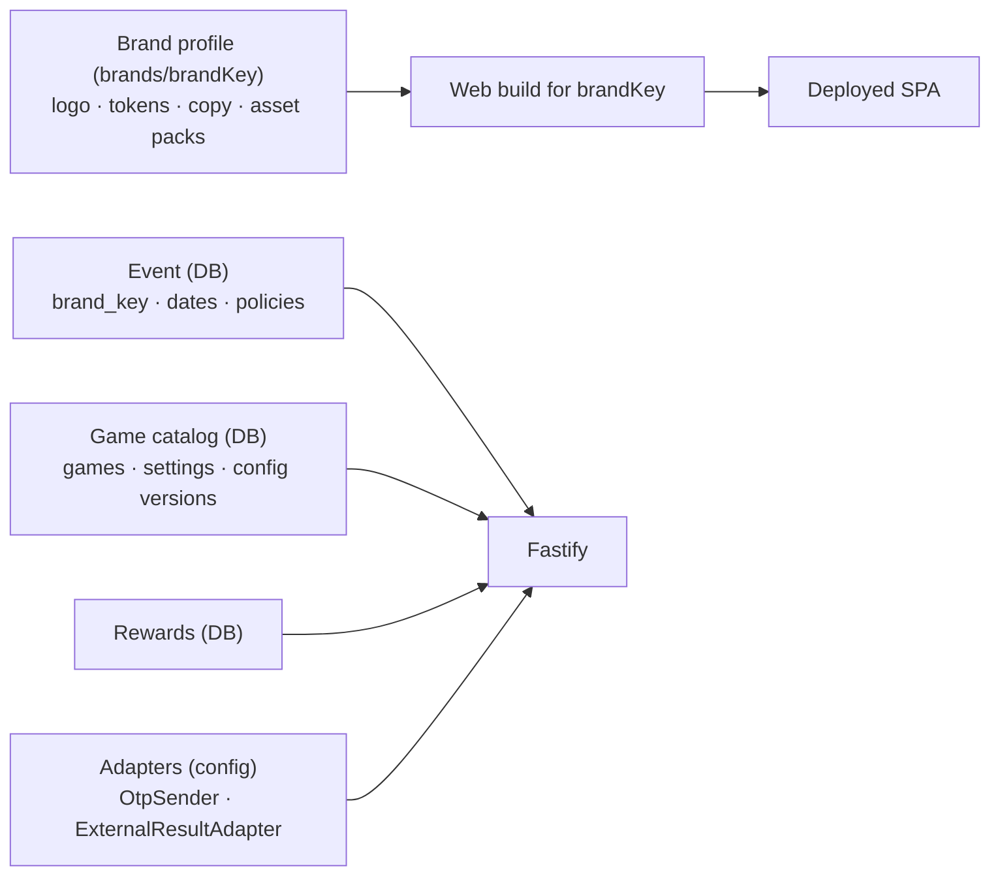

# Reuse and Branding (Future Exhibitions / Brands)

Decision: [ADR-013](../11-decisions/ADR-013-reuse-by-configuration.md). Principle: **reusable by configuration and modules, not multi-tenant SaaS.**

## 1. What must be reusable without rewriting

OTP and participant sessions · game session protocol · deterministic scoring infrastructure (`game-core` framework, replay validator) · Best Score and leaderboard · raffle tickets and live raffle · reward engine · admin RBAC and MFA · audit · outbox/external-delivery framework · realtime · observability.

None of these modules may reference Snowa by name, embed Snowa copy, or assume Snowa-specific products. Brand facts enter only through the configuration surfaces below.

## 2. Configuration surfaces

| Concern | Where it lives | Changed by |
|---|---|---|
| Brand identity (name, logo, favicon, PWA icons/manifest name) | `brands/<brandKey>/` (static, build-time) | Build/deploy |
| Theme tokens (colors, typography scale, radii, glow styles) | `brands/<brandKey>/tokens.*` consumed by `packages/ui` | Build/deploy |
| Persian copy (brand-specific strings, rules/FAQ, consent/privacy text) | `packages/i18n-fa` base keys + `brands/<brandKey>/copy.fa.*` overrides | Build/deploy |
| Game titles and descriptions | brand copy (display) — technical slugs stay stable | Build/deploy |
| Game assets and product imagery (washer, fridge, TV art) | `brands/<brandKey>/games/<slug>/` asset packs referenced by game asset manifests | Build/deploy |
| Game catalog for an event (which games, order, settings) | DB: `games`, `game_settings`, `game_config_versions` | Admin / Super Admin |
| Event configuration (dates, policies, identity policy, OTP params) | DB: `events` (with `brand_key`) | Super Admin |
| Reward definitions, rules, inventory | DB: reward tables | Admin |
| External integration | Adapter selected by config (`EXTERNAL_RESULT_ADAPTER=snowa`); each brand's receiving system gets its own adapter implementing the same port | Code (adapter) + config |
| OTP/SMS vendor and template | `OtpSender` adapter + config | Code (adapter) + config |

A game's **mechanic** (e.g., timing ring, sorting board, visual search) is platform code; its **skin** (product art, labels, item sets, zone names) is brand/config data. Example: Fridge Rush's items and zones are defined in `game_config_versions.params` and brand asset packs, so another brand's appliance can reuse the mechanic.

## 3. Brand profile concept

v1 deploys exactly one brand (`snowa`) and one active event per deployment. A future brand is a **new deployment** (own VPS or own instance) with its own brand profile, database and adapters — no shared runtime between brands.

## 4. Explicitly out of scope (until a real requirement exists)

Tenant provisioning · tenant billing · per-tenant infrastructure isolation · SaaS administration consoles · runtime tenant switching · cross-brand shared databases.

## 5. Guardrails for Phase 1 code

- Lint/review rule: no `snowa` string literals outside `brands/snowa/`, locale overrides, adapter implementations and seed data.
- External-delivery port is generic (`ExternalResultAdapter`); `SnowaResultAdapter` is one implementation.
- Game modules read item/zone/product definitions from config params and asset manifests, not constants.
