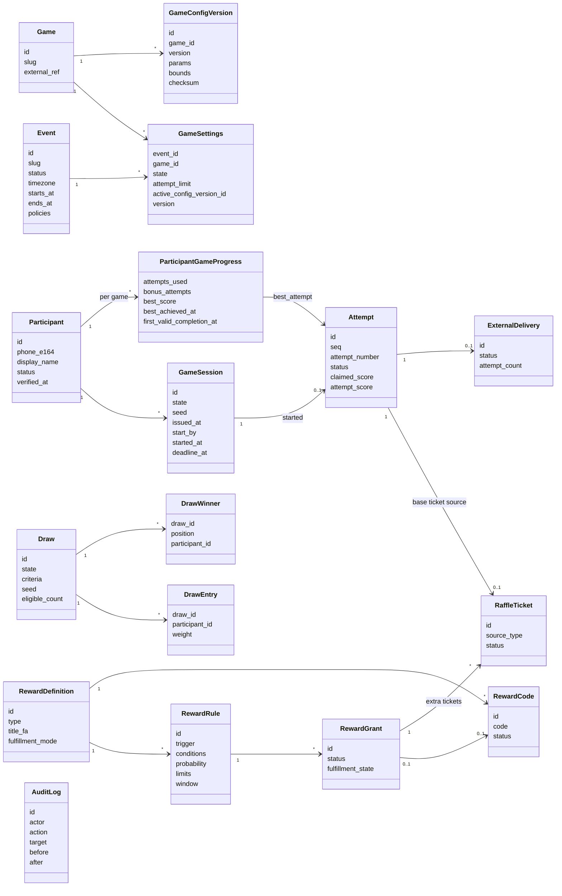
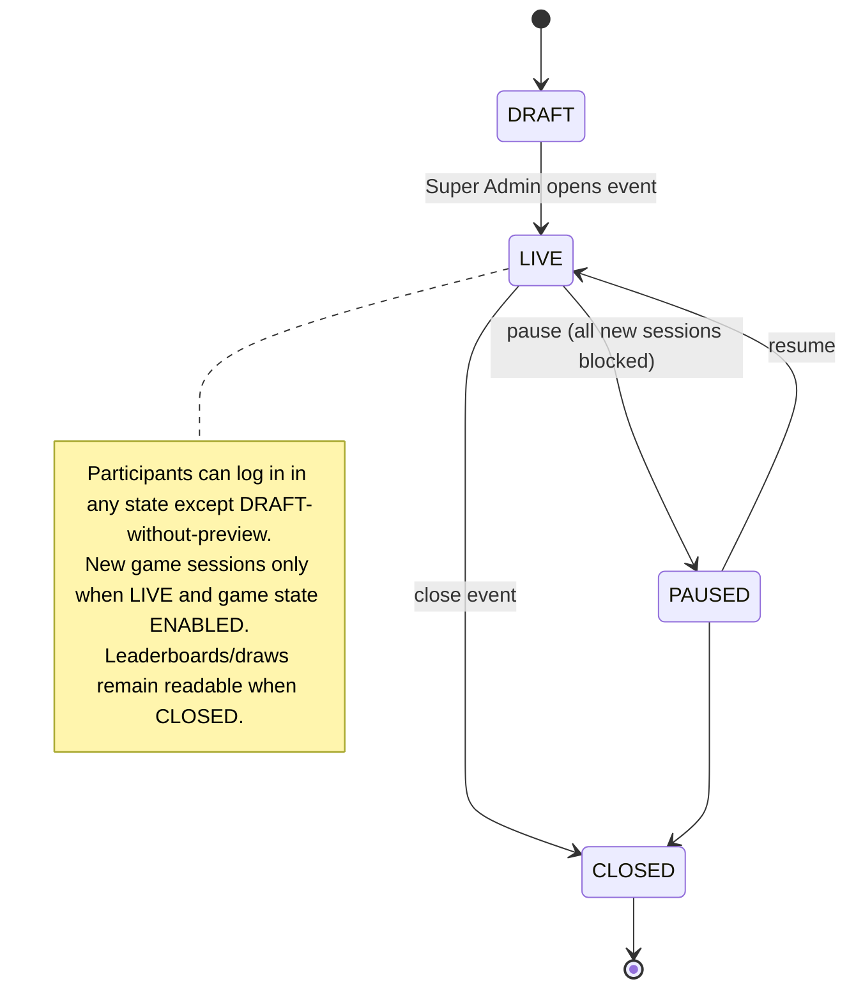

# Domain Model

## 1. Aggregates and relationships

## 2. Entity responsibilities

| Entity | Responsibility | Authority | Lifecycle doc |
|---|---|---|---|
| Event | Single exhibition config, status (`DRAFT/LIVE/PAUSED/CLOSED`), timezone, policies (core ticket policy, late-submission window, pause budget defaults) | Super Admin | this doc §4 |
| Participant | Verified phone identity + display name | identity module | [Participant lifecycle](02-participant-lifecycle.md) |
| Game / GameSettings | Catalog + live controls | catalog module | [Game/session/attempt](03-game-session-attempt-lifecycle.md) |
| GameConfigVersion | Immutable tuning & score bounds | catalog (published by Super Admin) | same |
| GameSession | Authorization envelope for one attempt | play module | same |
| Attempt | Gameplay record, validation outcome | play module | same |
| ParticipantGameProgress | Attempt counter, Best Score materialization, first completion marker | scoring module | [Best score & leaderboard](04-best-score-and-leaderboard.md) |
| RaffleTicket | Chance unit | tickets module | [Raffle tickets](05-raffle-tickets.md) |
| Reward* | Extra rewards | rewards module | [Rewards](06-rewards.md) |
| Draw* | Live raffle execution | raffle module | [Live raffle](07-live-raffle.md) |
| ExternalDelivery | Outbox | integration module | [Snowa adapter](../04-api/08-external-snowa-adapter.md) |
| AuditLog | Sensitive-action history | audit module | [Audit model](08-audit-model.md) |

## 3. Domain invariants (summary)

Full list with enforcement mechanism: [Invariants & transactions](../03-data/03-invariants-and-transactions.md).

| ID | Invariant |
|---|---|
| INV-01 | One participant per normalized phone per platform. |
| INV-02 | At most one open (`ISSUED` or `STARTED`) session per participant + game. |
| INV-03 | `attempts_used ≤ attempt_limit + bonus_attempts` at the moment each attempt started. |
| INV-04 | Attempt numbers per participant + game are unique and contiguous from 1. |
| INV-05 | A session produces at most one attempt; an attempt has at most one accepted result. |
| INV-06 | `best_score = max(attempt_score)` over valid attempts; null if none. |
| INV-07 | At most one `BASE` ticket per participant + event + game. |
| INV-08 | A single-use reward code is assigned to at most one grant. |
| INV-09 | Reward grants never exceed a rule's `total_limit` / `per_participant_limit`. |
| INV-10 | A completed draw's snapshot, seed and winners are immutable. |
| INV-11 | A participant appears at most once among a draw's winners. |
| INV-12 | Every valid attempt has exactly one external delivery record (unless integration disabled for the event). |
| INV-13 | Scores are integers ≥ 0. |

## 4. Event (exhibition) lifecycle

## 5. State machine index

| State machine | Location |
|---|---|
| Participant onboarding | [02-participant-lifecycle.md §2](02-participant-lifecycle.md#2-onboarding-state-machine) |
| OTP challenge | [02-participant-lifecycle.md §3](02-participant-lifecycle.md#3-otp-challenge-state-machine) |
| Game availability | [03-game-session-attempt-lifecycle.md §1](03-game-session-attempt-lifecycle.md#1-game-availability) |
| Game session | [03-game-session-attempt-lifecycle.md §2](03-game-session-attempt-lifecycle.md#2-game-session-state-machine) |
| Attempt | [03-game-session-attempt-lifecycle.md §3](03-game-session-attempt-lifecycle.md#3-attempt-state-machine) |
| Raffle ticket | [05-raffle-tickets.md §3](05-raffle-tickets.md#3-ticket-state-machine) |
| Reward grant | [06-rewards.md §5](06-rewards.md#5-reward-grant-state-machine) |
| Live raffle (draw) | [07-live-raffle.md §4](07-live-raffle.md#4-draw-state-machine) |
| External delivery | [../04-api/08-external-snowa-adapter.md §5](../04-api/08-external-snowa-adapter.md#5-delivery-state-machine) |
| Event | this document §4 |
