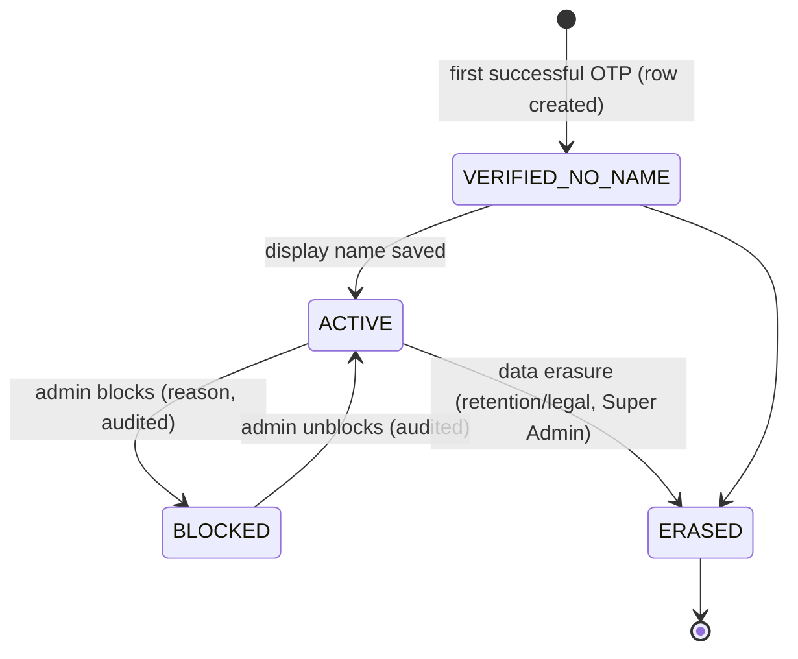
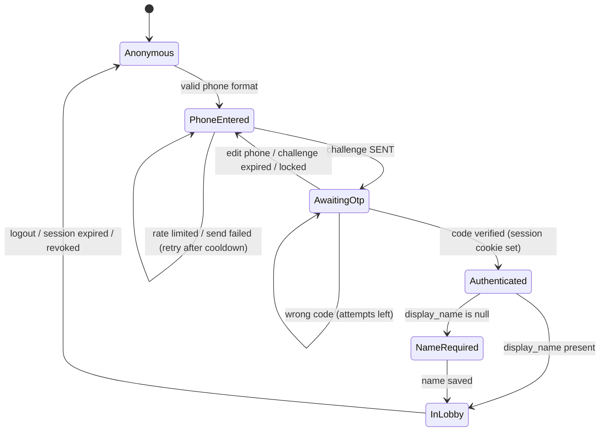
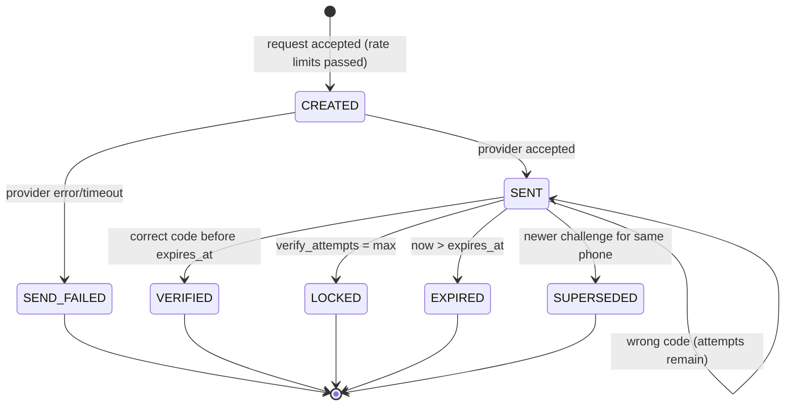
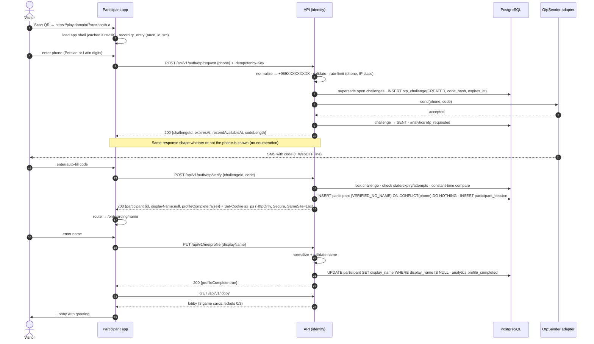
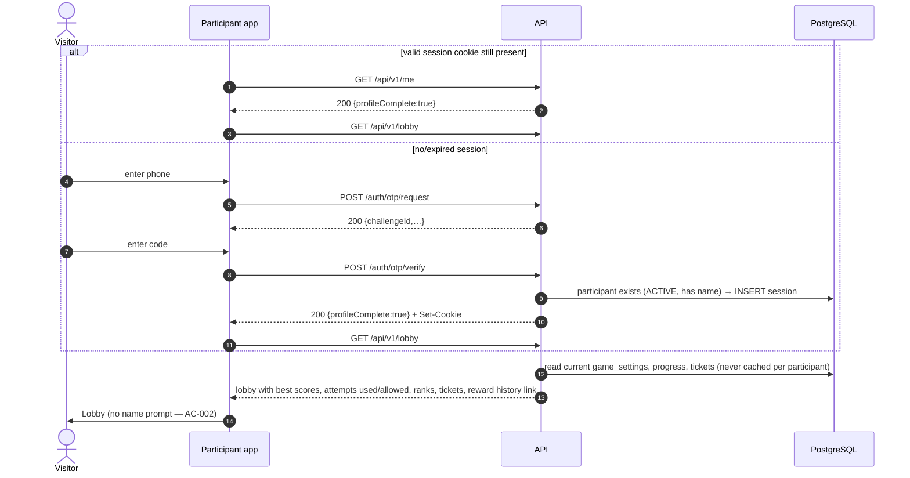

# Participant Lifecycle, Onboarding and OTP

Source: SPEC §4, §6, PD-02, PD-03, AC-001, AC-002. API: [Auth & profile API](../04-api/02-auth-and-profile-api.md). Security: [Authentication](../07-security/02-authentication-and-sessions.md).

## 1. Participant record lifecycle

- A participant row is created **only after successful OTP verification** (no rows for unverified phones → no enumeration, no junk).
- Persisted `participants.status` has three values (`ACTIVE`, `BLOCKED`, `ERASED`). `VERIFIED_NO_NAME` is a **derived** state: `status = ACTIVE AND display_name IS NULL`.
- `BLOCKED`: cannot create game sessions; existing sessions revoked; excluded from public leaderboards and draw eligibility; data retained.
- `ERASED`: phone replaced by irreversible hash, name removed; attempts retained in anonymized form if retention policy requires (OQ-13).

## 2. Onboarding state machine

Rule: the server rejects lobby and game endpoints with `403 PROFILE_INCOMPLETE` while `display_name` is null, so skipping the name screen client-side is impossible (AC-001).

## 3. OTP challenge state machine

| Parameter (event config) | Recommended default | Notes |
|---|---|---|
| `otp.length` | 5 | Concept art shows 5 digits (CA-01); OQ-12 |
| `otp.ttl_seconds` | 120 | |
| `otp.resend_cooldown_seconds` | 60 | Concept shows ~45 s |
| `otp.max_verify_attempts` | 5 per challenge | then LOCKED |
| `otp.max_sends_per_phone` | 5 / 15 min, 10 / 24 h | |
| Code generation | `crypto.randomInt(0, 10^len)` zero-padded | |
| Code storage | `HMAC-SHA256(pepper, challenge_id ‖ code)`; plaintext never stored/logged | |
| Comparison | constant-time | |

Only the **latest** SENT challenge for a phone is verifiable (older → SUPERSEDED), so resend does not multiply guessing chances.

## 4. Sequence — first-time participant

## 5. Sequence — returning participant

A `BLOCKED` participant receives `403 PARTICIPANT_BLOCKED` at verify time with a neutral Persian message.

## 6. Display name policy

| Topic | Rule |
|---|---|
| Set | Once, when null |
| Edit | Not supported in v1 (OQ-09). Admin can correct/hide a name (audited) for moderation |
| Validation | See [Localization §5](../01-architecture/11-localization-and-rtl.md#5-input-normalization-client-and-server) |
| Uniqueness | Not unique (display data only) |
| Public use | Per leaderboard identity policy (OQ-06) |
| Moderation | Optional deny-list filter; admin `hide_display_name` flag replaces public name with a neutral placeholder (OQ-24) |

## 7. Consent (OQ-14)

If explicit consent is required, the name step (first time) shows a required checkbox. The server stores `consent_records(participant_id, terms_version, accepted_at, ip_hash)`. The lobby endpoint enforces a current consent version when `event.policies.require_consent = true`. Disabled by default until confirmed.
