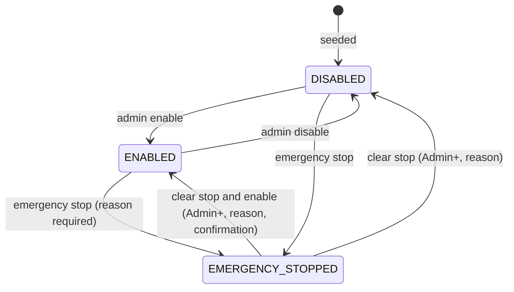
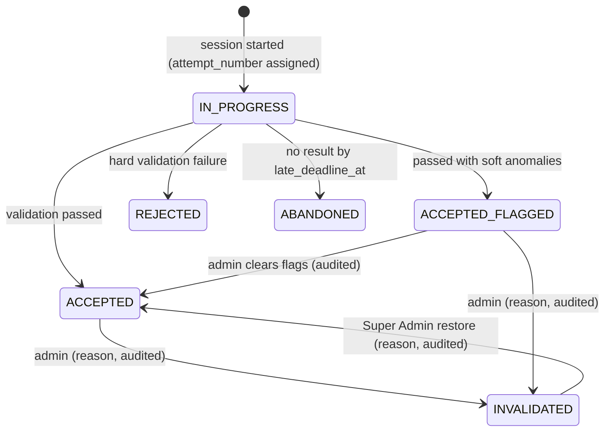
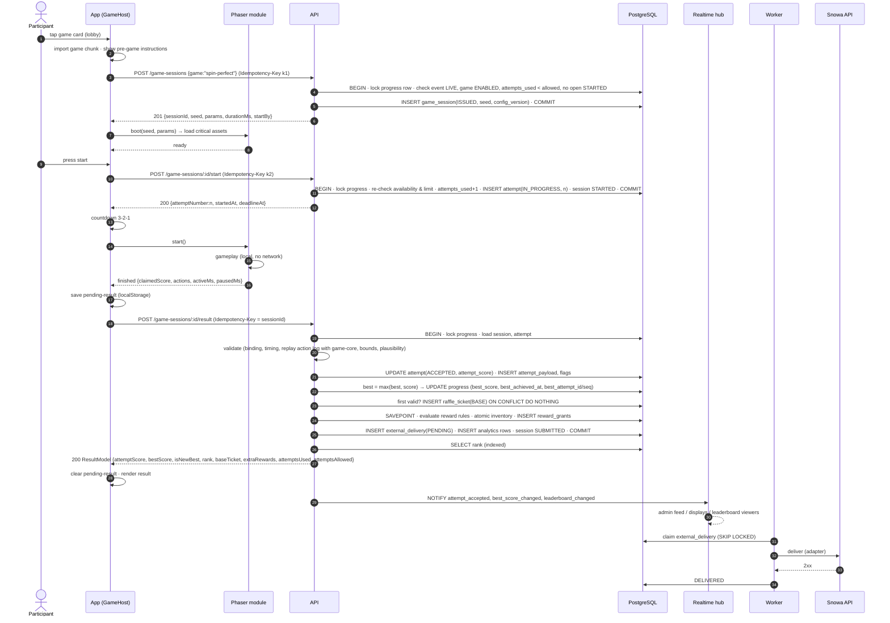
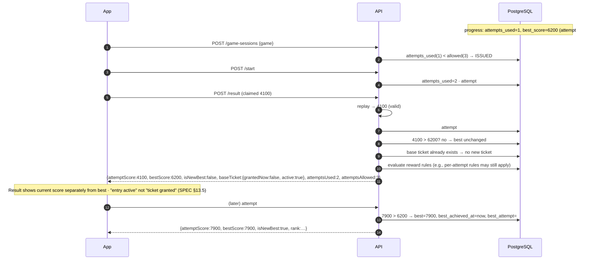

# Game Availability, Game Session and Attempt Lifecycle

Source: SPEC §7, §8, §16.2, §21, §22.2, PD-05, PD-09, AC-005, AC-006, AC-019. API: [Game session API](../04-api/03-game-session-api.md). Runtime: [Shared game runtime](../05-games/01-shared-game-runtime.md).

## 1. Game availability

Effective playability = `event.status = LIVE` AND `game_settings.state = ENABLED`.

| Effect on | DISABLED | EMERGENCY_STOPPED |
|---|---|---|
| Lobby card | Visible, "temporarily unavailable" (AC-005) | Same |
| New session (`POST /game-sessions`) | `409 GAME_UNAVAILABLE` | `409 GAME_UNAVAILABLE` |
| ISSUED session `start` | `409 GAME_UNAVAILABLE`, session → CANCELLED, **no attempt consumed** | Same |
| STARTED session submit | Accepted normally (preserve data) | Accepted; attempt flagged `DURING_EMERGENCY_STOP` for review |
| Realtime | `game_status_changed` | `game_status_changed` + admin alert |
| Audit | yes | yes, reason mandatory |

Event-wide stop = setting the event to `PAUSED` (same effects for all games).

### Lobby card state (derived, per participant)

| Card state | Condition | Primary action |
|---|---|---|
| `UNAVAILABLE` | not playable | none |
| `IN_PROGRESS` | open STARTED session before deadline | "attempt in progress/interrupted" info |
| `NOT_PLAYED` | playable, `attempts_used = 0` | start |
| `PLAYED_REMAINING` | playable, `0 < attempts_used < allowed` | play again |
| `EXHAUSTED` | `attempts_used ≥ allowed` | none; shows best & rank (completed) |
| `LOADING_ERROR` | client could not load config | retry (never start without server session) |

`allowed = game_settings.attempt_limit + progress.bonus_attempts`. If an admin lowers `attempt_limit` below a participant's `attempts_used`, the card shows `EXHAUSTED`; history is untouched.

## 2. Game session state machine

```mermaid
stateDiagram-v2
  [*] --> ISSUED: POST /game-sessions (checks passed)
  ISSUED --> STARTED: POST /start (checks re-run; attempt created)
  ISSUED --> EXPIRED: now > start_by (no attempt consumed)
  ISSUED --> CANCELLED: game disabled / participant blocked / superseded
  STARTED --> SUBMITTED: result received (accepted OR rejected)
  STARTED --> EXPIRED: now > late_deadline_at without result (attempt ABANDONED)
  SUBMITTED --> [*]
  EXPIRED --> [*]
  CANCELLED --> [*]
```

| Field | Value |
|---|---|
| `id` | UUIDv4 (unguessable, used in URLs) |
| `seed` | 128-bit CSPRNG, hex; returned at ISSUED so assets/layouts can prepare |
| `start_by` | `issued_at + 10 min` (covers slow asset loads) |
| `started_at` | DB time at `/start` |
| `deadline_at` | `started_at + duration_ms + pause_budget_ms + submit_grace_ms` |
| `late_deadline_at` | `deadline_at + late_submission_window_ms` |
| `config_version_id` | Pinned at ISSUED; used for validation even if a new version is published |

Defaults (event policy, OQ-15): `pause_budget_ms = 60 000`, `submit_grace_ms = 20 000`, `late_submission_window_ms = 600 000`.

**Open-session rule (INV-02):** `POST /game-sessions` when an ISSUED session exists for the same participant + game returns that session (idempotent re-entry, e.g., after reload). When a STARTED session exists and is before `late_deadline_at`, it returns `409 SESSION_ALREADY_ACTIVE` with the session id; the participant cannot start a parallel attempt.

## 3. Attempt state machine

An attempt is created at `/start`. It consumes one allowed attempt irrevocably (except by explicit admin bonus).

| Status | Counts toward attempts used | Valid for Best Score | Grants base ticket | Sent externally |
|---|---|---|---|---|
| IN_PROGRESS | yes | no | no | no |
| ACCEPTED | yes | yes | if first valid | yes |
| ACCEPTED_FLAGGED | yes | yes | if first valid | yes |
| REJECTED | yes | no | no | no |
| ABANDONED | yes | no | no | no |
| INVALIDATED | yes | no (best recomputed) | ticket handling per OQ-23 | correction delivery per contract (OQ-04) |

On INVALIDATED/restore, the scoring module recomputes `best_score` for that participant + game from remaining valid attempts in the same transaction and emits `best_score_changed` / `leaderboard_changed`.

## 4. Attempt consumption policy (answers SPEC §8.2)

| Situation | Attempt consumed? |
|---|---|
| Server error creating session | No (no session) |
| Asset load fails / participant leaves at pre-game | No (ISSUED expires) |
| `/start` request fails before commit | No (client retries `/start` with same Idempotency-Key) |
| `/start` committed but response lost | Yes, but retry of `/start` returns the same STARTED state — client proceeds normally |
| Page refresh / crash during gameplay | Yes (ABANDONED unless payload was saved after finish) |
| Browser backgrounded during gameplay | Yes, attempt continues under pause budget |
| Network loss during gameplay | Yes; gameplay continues offline; result submitted when network returns (within late window) |
| Game disabled during gameplay | Yes; submission still accepted |
| Result rejected | Yes |

Operator remedy for genuine booth accidents: grant `bonus_attempts` to a participant + game (permission `participant.grant_bonus_attempt`, reason, audit).

## 5. Sequence — game attempt (full pipeline)

## 6. Sequence — retry attempt (existing Best Score)

Equal score to current best (`attempt_score = best_score`) does **not** replace the best; `best_achieved_at` keeps the earlier time (preserves the tie-break advantage of the earlier achievement).
