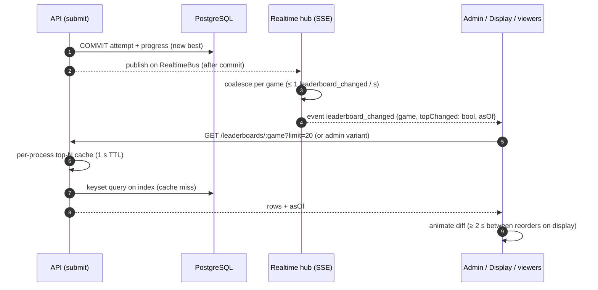

# Best Score and Leaderboard Rules

Source: SPEC §12, §14, PD-06, AC-007, AC-008, AC-012, AC-017. API: [Lobby, leaderboard & rewards API](../04-api/04-lobby-leaderboard-rewards-api.md).

## 1. Best Score definition

```
best_score(participant, game) = MAX(attempt_score)
  over attempts WHERE participant, game, event match
  AND status IN ('ACCEPTED', 'ACCEPTED_FLAGGED')
best_score is NULL when no valid attempt exists.
```

- Source of truth: the `attempts` table. `participant_game_progress.best_score` is a **materialization** maintained in the same transaction as every status change of an attempt, and verified by the `integrity.reconcile` job.
- Replacement rule: strictly greater replaces. Equal does not.
- `best_achieved_at` = `accepted_at` of the attempt that set the current best. `best_attempt_seq` = that attempt's global monotonic sequence (bigint identity).
- Example (SPEC §12.1): 6200 → 4100 → 7900 ⇒ best 7900; the 4100 attempt remains in history.

## 2. Ranking

Per game, per event. Total order:

| Priority | Key | Direction |
|---|---|---|
| 1 | `best_score` | DESC |
| 2 | `best_achieved_at` | ASC (earlier achiever ranks higher) [SPEC §12.3] |
| 3 | `best_attempt_seq` | ASC (deterministic final tie-break for identical timestamps) |

No random tie-break. Rank is unique (no shared ranks), because the order is total.

Ranked population: participants with non-null best score, `status = ACTIVE`, and `progress.excluded_from_ranking = false` (admin exclusion for confirmed cheaters, audited). BLOCKED participants are excluded.

### Rank query (single participant)

```sql
-- illustrative
SELECT 1 + COUNT(*) AS rank
FROM participant_game_progress p
WHERE p.event_id = $event AND p.game_id = $game AND p.ranked = true
  AND (  p.best_score > $score
      OR (p.best_score = $score AND p.best_achieved_at < $achieved_at)
      OR (p.best_score = $score AND p.best_achieved_at = $achieved_at AND p.best_attempt_seq < $seq));
```

Implementation uses a composite index `(event_id, game_id, best_score DESC, best_achieved_at ASC, best_attempt_seq ASC) WHERE ranked`. Cost is O(rank) index-only scan; at 50k participants per game this is sub-10 ms. Upgrade path if needed: cached top-N + Redis sorted set (ADR-004).

## 3. Leaderboard views

| View | Audience | Content | Paging |
|---|---|---|---|
| Public (participant app) | Authenticated participants | rank, public name, score; own row highlighted and always included (`me`) | Top 100 (cursor pagination up to 1000) |
| Public display | Booth screen | top 10–20, large type, stable animation | fixed size |
| Admin | Operators+ | rank, name, masked phone (Operator) / full phone (permission `participant.view_phone`), score, achieved at, attempts, flags | cursor pagination, full range, export (Admin+) |

Cursor = `(best_score, best_achieved_at, best_attempt_seq)` of last row (keyset pagination; stable under concurrent updates).

### Public identity projection (OQ-06)

Recommended default per SPEC §3.1: `public_name = display_name` (after moderation), no phone. Configurable event policy:

| Policy value | Rendering |
|---|---|
| `NAME` (default) | `علی رضایی` |
| `NAME_INITIAL` | first name + surname initial |
| `NAME_MASKED_PHONE` | name + `•••6789` (last 4) |
| `MASKED_PHONE` | `0912•••6789` (concept art style) |

Full phone numbers never appear in any public/display payload (AC-017) — enforced at the serializer level: public DTOs have no phone field at all.

## 4. Live leaderboard update flow



`topChanged` lets viewers of the top-N skip re-fetching when the change is outside their visible range (hub compares new best to the cached N-th score).

## 5. Caching and consistency

| Layer | TTL | Staleness exposure |
|---|---|---|
| Top-N per game (per process) | 1 s | ≤ 1 s + hint latency |
| Participant rank in result response | none (computed after commit) | exact at response time |
| Lobby rank | none | exact at fetch |
| Display | driven by hints + 10 s safety poll | stale badge if no heartbeat 5 s |

## 6. Scale concerns

- Write hot spots: none shared across participants (each submit locks only its own progress row).
- Read hot spot: top-N — served from 1 s cache; at most (instances × games) queries/s — one instance in v1.
- Rank for deep positions: O(rank) index scan; acceptable to ~100k rows. Load test verifies (see [Load testing](../08-quality/04-load-and-resilience-testing.md)).
