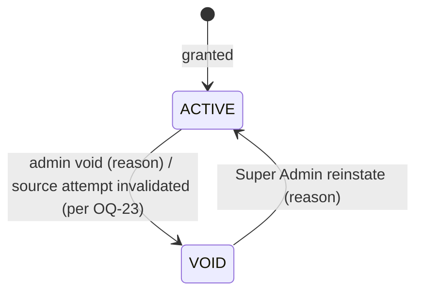
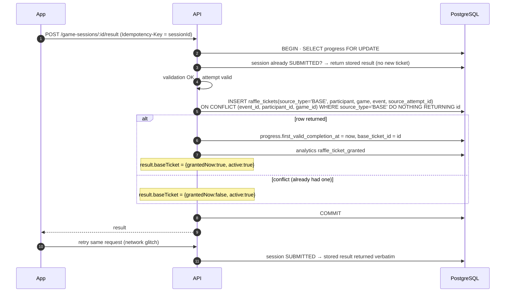

# Raffle Ticket Model

Source: SPEC §13.1–13.2, §13.5, PD-07, AC-009. **Raffle tickets are entitlements; the Live Raffle Draw ([07-live-raffle.md](07-live-raffle.md)) is the separate process that selects winners.**

## 1. Ticket sources

| `source_type` | Created by | Quantity | Uniqueness |
|---|---|---|---|
| `BASE` | Result pipeline on first valid completion of a game | 1 | Unique per `(event_id, participant_id, game_id)` where `source_type='BASE'` |
| `REWARD` | Reward engine, from an "extra raffle ticket" reward grant | N rows (one per ticket) | Unique per `(reward_grant_id, ordinal)` |
| `ADMIN` | Manual grant (Super Admin, reason, audit) | N rows | Unique per `(admin_action_id, ordinal)` |

One row = one ticket. Counting tickets is `COUNT(*) WHERE status='ACTIVE'`. Rows (not a quantity column) make voiding a single ticket and weighted draw snapshots straightforward.

## 2. Core ticket rules

1. Granted when an attempt becomes valid (`ACCEPTED`/`ACCEPTED_FLAGGED`) and no `BASE` ticket exists for that participant + game.
2. Replays: `+0` base tickets; the result shows "entry active/already received" (`result.ticketActive`), never "ticket granted" [SPEC §13.5].
3. The core ticket is **not a reward rule** and cannot be removed via reward editing [SPEC §13.2]. It is controlled by `event.policies.core_ticket = { enabled: true, per_game_quantity: 1 }`, editable only by Super Admin (audited). v1 default must remain `enabled: true, 1`.
4. Minimum engagement for base ticket: default none (score 0 valid completion earns it) — OQ-18.

## 3. Ticket state machine

- `VOID` tickets are excluded from draw eligibility and counts; rows are never deleted.
- Winning a draw does **not** change ticket status (tickets are chances, not consumable, unless the event decides otherwise — covered by draw policy "exclude previous winners").
- OQ-23: when a source attempt is invalidated, recommended default = void the base ticket only if the participant has no other valid attempt for that game; otherwise re-point `source_attempt_id` to the earliest remaining valid attempt.

## 4. Base ticket grant sequence (idempotency)

Three layers prevent duplicates: (1) session state (one result per session), (2) progress row lock serializes the participant+game, (3) partial unique index (last line of defense).

## 5. Lobby/profile ticket presentation

`GET /lobby` returns `tickets: { total_active, base: {spin-perfect: true, fridge-rush: false, vision-hunt: false}, extra: n }` → "2/3" core progress plus extra count.
