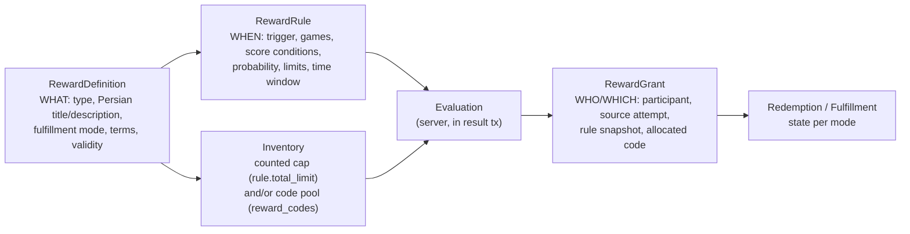
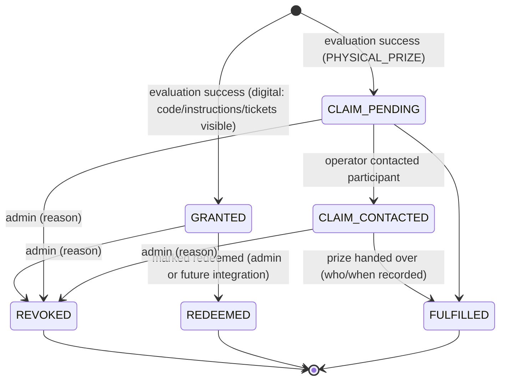
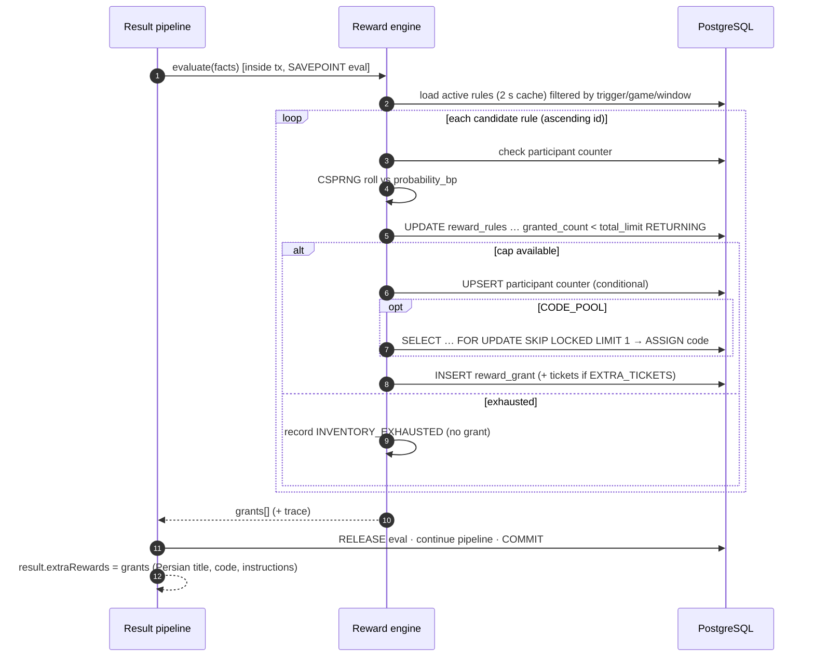

# Reward Model (Extra Rewards)

Source: SPEC §13.3–13.5, §16.4, PD-08, AC-010, AC-014. Decision: [ADR-007](../11-decisions/ADR-007-reward-architecture.md). The core base ticket is **not** part of this engine (see [Raffle tickets](05-raffle-tickets.md)).

## 1. Separation of concepts



Games never reference rewards. The only coupling is the canonical result facts (`game`, `attempt_score`, `best_score`, `is_new_best`, `is_first_valid_completion`, `all_games_completed`) passed to the evaluator.

## 2. Reward definition types

| `type` | Fulfillment mode | Payload | Inventory |
|---|---|---|---|
| `DISCOUNT_CODE` | `CODE_POOL` (single-use codes, uploaded) or `SHARED_CODE` (one campaign code) | code, terms, valid_until | pool size or counted cap |
| `EXTRA_TICKETS` | `AUTO` → creates N `raffle_tickets(source_type='REWARD')` | `quantity` ≥ 1 | counted cap optional |
| `PHYSICAL_PRIZE` | `CLAIM` → fulfillment workflow tracked by admin | prize description, claim instructions | counted cap **required** |
| `BENEFIT` (free shipping / purchase benefit) | `CODE_POOL`, `SHARED_CODE` or `INSTRUCTIONS` | terms, validity | counted cap **required** |
| `SPECIAL` | `INSTRUCTIONS` | Persian title/description | counted cap optional |
| future custom | new `type` + fulfillment handler | JSON schema per type | — |

Persian presentation fields (`title_fa`, `description_fa`, `terms_fa`) are admin-entered and validated (length, NFC, no bidi controls).

## 3. Reward rules

| Field | Meaning |
|---|---|
| `trigger` | `ATTEMPT_ACCEPTED` (any valid attempt) · `FIRST_VALID_COMPLETION` · `NEW_BEST` · `ALL_GAMES_COMPLETED` (fires once when the third game's first valid completion happens) |
| `game_ids` | subset or null (= any game) |
| `min_attempt_score` / `min_best_score` | optional thresholds (≥) |
| `probability_bp` | 0–10000 basis points (10000 = always) |
| `active_from` / `active_until` | window (server time) |
| `total_limit` | global cap of grants (inventory), nullable only when explicitly allowed |
| `per_participant_limit` | default 1 |
| `exclusive_group` | at most one grant per group per evaluation (e.g., "one instant prize per result") |
| `priority` | evaluation order within group (lower first) |
| `status` | `DRAFT` · `ACTIVE` · `PAUSED` · `ARCHIVED` |
| `version` | increments on edit; grants store `rule_snapshot` |

Safety rules (server-enforced, not only UI) [SPEC §16.4]:
- `PHYSICAL_PRIZE` and `BENEFIT` rules MUST have `total_limit`.
- Rules with `total_limit = null` require permission `reward.create_unlimited` (Super Admin) and an explicit `unlimited_confirmed = true` flag.
- Activating a rule with `probability_bp = 10000` and no `total_limit` for non-ticket types is rejected.

## 4. Evaluation algorithm (inside result transaction, savepoint-protected)

```text
facts = {participant, game, attempt_score, best_score, is_new_best, is_first_valid_completion, all_games_completed, now}
rules = active rules matching trigger & game & window, ordered by (exclusive_group, priority, id)
for rule in rules:
    if group already granted in this evaluation: continue
    if not conditions(rule, facts): continue
    SAVEPOINT r
    if participant counter(rule) >= per_participant_limit: release; continue         -- read under row lock
    roll = csprng_int(0, 9999); record roll in evaluation trace
    if roll >= rule.probability_bp: release; continue
    UPDATE reward_rules SET granted_count = granted_count + 1
       WHERE id = rule.id AND (total_limit IS NULL OR granted_count < total_limit)   -- atomic cap
    if 0 rows: record INVENTORY_EXHAUSTED; ROLLBACK TO r; continue
    UPSERT reward_participant_counters (+1 WHERE granted_count < per_participant_limit) -- atomic per-user cap
    if 0 rows: ROLLBACK TO r; continue
    if mode == CODE_POOL:
        SELECT id FROM reward_codes WHERE definition_id = … AND status='AVAILABLE'
          ORDER BY id LIMIT 1 FOR UPDATE SKIP LOCKED
        if none: record CODE_POOL_EMPTY; ROLLBACK TO r; continue
        UPDATE reward_codes SET status='ASSIGNED', grant_id=…
    INSERT reward_grants(... rule_snapshot, source_attempt_id)  -- unique (rule_id, source_attempt_id)
    if type == EXTRA_TICKETS: INSERT quantity raffle_tickets(source_type='REWARD')
    RELEASE r
```

- Lock ordering: rules processed in ascending `id` → no deadlocks between concurrent evaluations.
- Idempotency: unique `(rule_id, source_attempt_id)`; plus the whole evaluation runs once per session submission.
- If the evaluation throws unexpectedly, the outer savepoint is rolled back, the attempt is still accepted with flag `REWARD_EVAL_DEFERRED`, and the `rewards.reevaluate` background job re-evaluates later (same unique keys make it safe). The participant sees base result immediately; a deferred reward appears in "my rewards".
- Probability rolls use `crypto.randomInt`; the trace (`rule_id`, `roll`, `threshold`, outcome) is stored in `attempt_payloads.evaluation_trace` for audit.

## 5. Reward grant state machine



Revocation does not return a revealed single-use code to the pool (code → `VOID`); counted inventory is returned only if the admin selects "return to inventory" (audited).

## 6. Dynamic reward sequence



## 7. Presentation order (client) [SPEC §13.5]

attempt score → best score / new-best state → rank → base ticket (granted now / already active) → extra reward(s) → actions (replay if allowed, lobby, leaderboard).

## 8. Live-change behavior

| Admin change | Effect |
|---|---|
| Create/activate rule | Applies to results submitted after the change (≤ 2 s cache) |
| Pause rule | Stops new grants; existing grants unaffected |
| Increase `total_limit` | Immediately more inventory |
| Decrease `total_limit` below `granted_count` | Allowed; rule effectively exhausted |
| Upload more codes | Appends `AVAILABLE` codes (dedupe by unique `(definition_id, code)`) |
| Edit conditions | New `version`; grants keep their `rule_snapshot` |
