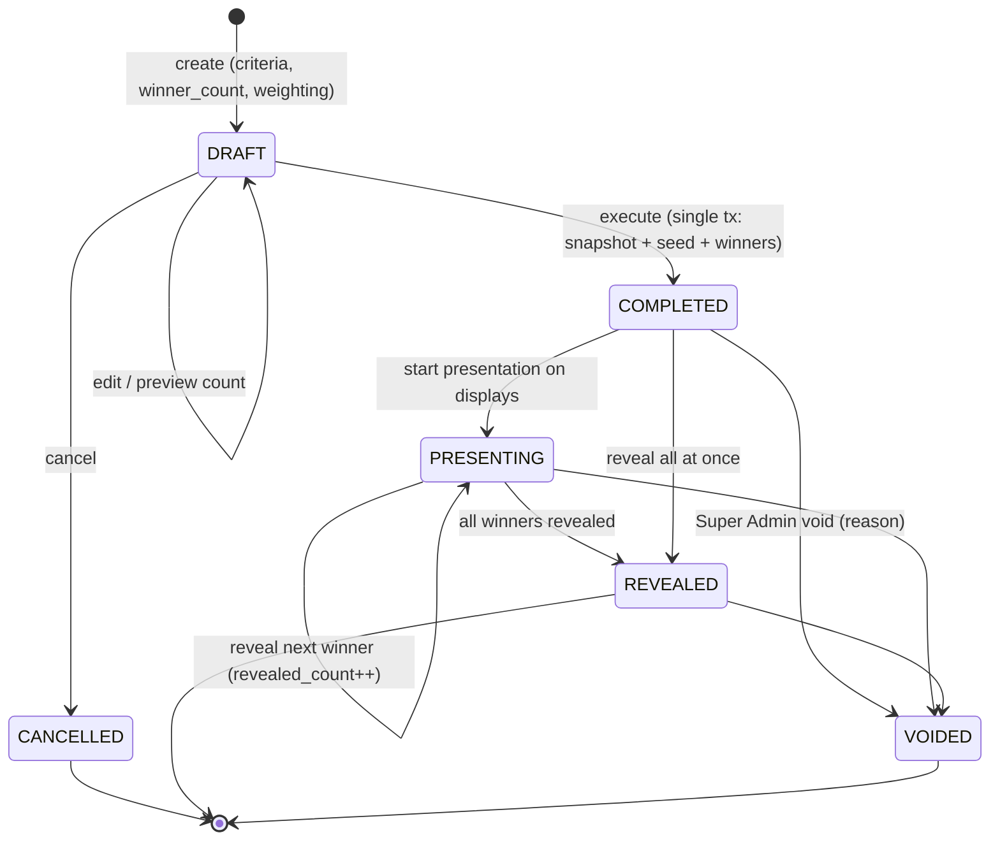
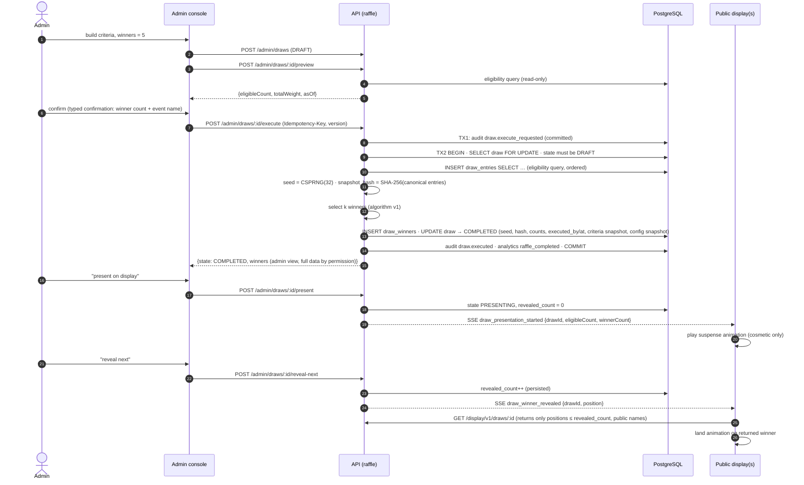

# Live Raffle (Draw) Model

Source: SPEC §15, §16.5, PD-10, AC-015, AC-016, §22.1 ("never show a draw winner until persisted"). Decision: [ADR-011](../11-decisions/ADR-011-raffle-selection.md). API: [Raffle API](../04-api/06-raffle-api.md).

## 1. Ticket vs draw

| | Raffle ticket | Draw |
|---|---|---|
| What | Entitlement unit (chance) | One execution selecting winners |
| Created by | Result pipeline / reward engine / admin | Admin command |
| Changes over time | ACTIVE ↔ VOID | Immutable once COMPLETED (except reveal progress and VOID marking) |
| Used by | Draw eligibility & weighting | Presentation, audit, prize fulfillment |

## 2. Eligibility criteria

Criteria are a JSON document validated by schema, combined with **AND** [SPEC §15.1]:

| Criterion | Schema | Semantics (evaluated at execution time) |
|---|---|---|
| `population` | `ALL_VERIFIED` \| `PLAYED_ANY` \| `PLAYED_GAME{game}` \| `COMPLETED_ALL` | Verified = participant ACTIVE with name. Played = ≥1 valid attempt. Completed all = valid attempt in all three games |
| `score` | `{game, op: GT\|GTE, value}` | on best score of that game |
| `rank_range` | `{game, from, to}` | rank (per [ranking rules](04-best-score-and-leaderboard.md#2-ranking)) at execution time, inclusive |
| `tickets` | `{min_count ≥ 1}` | active tickets (all sources) |
| `exclude_previous_winners` | bool (default `true`, OQ-10) | excludes winners of COMPLETED, non-VOID draws of this event |
| always | — | BLOCKED/ERASED participants and ranking-excluded participants are never eligible |

Weighting (OQ-08 — open product decision):

| `weighting` | Entry weight | Note |
|---|---|---|
| `TICKETS` (**recommended default**) | number of ACTIVE tickets | Consistent with SPEC §13.3 "extra ticket adds extra entries"; participants with 0 tickets are ineligible |
| `UNIFORM` | 1 per eligible participant | For "top-N ranking" draws where tickets are irrelevant |

In both modes a participant wins **at most once per draw** (selection without replacement at participant level) [SPEC §15.3].

## 3. Selection algorithm (v1)

```text
inputs: entries[] = eligible participants ordered by participant_id ASC, each with weight w_i > 0
        k = winner_count (1 ≤ k ≤ |entries|)
        seed = 32 bytes from CSPRNG, generated inside the execution transaction after the snapshot is built
prng(counter) = HMAC-SHA256(key = seed, msg = draw_id ‖ ":" ‖ counter)  → 256-bit integer
uniform(n): take 64-bit chunks from prng output, rejection-sample to avoid modulo bias, counter++ as needed
repeat k times:
    W = sum of remaining weights
    r = uniform(W)
    walk remaining entries in order accumulating weights; choose first entry with cumulative > r
    append to winners (position = 1..k); remove it from remaining
algorithm_version = "weighted-wor-hmac-sha256-v1"
```

Properties: unbiased, reproducible from `(entries, seed, draw_id, algorithm_version)`, and not influenced by the browser. Complexity O(n·k) — at 50k entries × 100 winners = 5M steps (< 1 s).

## 4. Draw state machine



- There is no "re-roll". A contested draw is `VOIDED` (record kept, reason required) and a **new** draw is created with `replaces_draw_id`. Both appear in history.
- Snapshot, seed, winners, criteria, `eligible_count`, `total_weight` are write-once (DB trigger rejects updates after COMPLETED).

## 5. Live raffle sequence



Displays never receive unrevealed winners, so inspecting the display browser cannot leak results early; the animation only visualizes an already-persisted result [SPEC §15.4].

## 6. Duplicate and safety rules

| Risk | Protection |
|---|---|
| Admin double-clicks execute | Idempotency-Key + row lock; second call returns the same COMPLETED draw |
| Two admins execute the same draft | Row lock + state check; one wins, other gets the completed result |
| Admin executes twice to fish for a preferred winner | Each execution needs a new draft; all executions + requests audited; voiding requires Super Admin + reason; history visible |
| Winner count > eligible | `422 NOT_ENOUGH_ELIGIBLE` (no partial draw unless `allow_fewer = true`) |
| Display disconnect mid-reveal | Persisted `revealed_count`; reconnect renders current state |
| Participant with many tickets wins multiple times | Selection without replacement at participant level |

## 7. Audit & verification

Stored per draw: `id`, `event_id`, `criteria` (JSON), `weighting`, `winner_count`, `eligible_count`, `total_weight`, `preview_count` (last preview), `snapshot_hash`, `seed`, `algorithm_version`, `app_version`, `executed_by`, `executed_at`, `config_snapshot` (event policies relevant to draws), `replaces_draw_id`, `void_reason`, `voided_by/at`.

A CLI `verify-draw <id>` (Phase 5) recomputes the snapshot hash from `draw_entries` and the winners from the seed, and must reproduce `draw_winners` exactly. The export for external auditors includes entries with pseudonymous ids.
