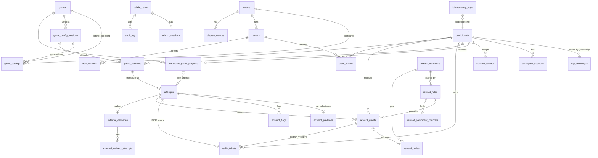

# Conceptual Database Schema

PostgreSQL 16+ ([ADR-004](../11-decisions/ADR-004-persistence.md)). Column-level definitions: [Entity definitions](02-entity-definitions.md). Invariants: [Invariants & transactions](03-invariants-and-transactions.md).

## 1. ERD

## 2. Table groups

| Group | Tables | Write rate at peak (A-01) | Growth |
|---|---|---|---|
| Identity | `participants`, `otp_challenges`, `participant_sessions`, `consent_records` | ~10 OTP/s | O(participants × logins) |
| Catalog | `events`, `games`, `game_settings`, `game_config_versions` | admin-only | tiny |
| Play | `game_sessions`, `attempts`, `attempt_payloads`, `attempt_flags`, `participant_game_progress` | ~20 submits/s | O(attempts) — largest |
| Rewards/tickets | `raffle_tickets`, `reward_definitions`, `reward_rules`, `reward_codes`, `reward_grants`, `reward_participant_counters` | ≤ submits | O(participants × games) |
| Raffle | `draws`, `draw_entries`, `draw_winners` | per draw | O(draws × eligible) |
| Integration | `external_deliveries`, `external_delivery_attempts` | = valid attempts | O(attempts) |
| Admin/ops | `admin_users`, `admin_sessions`, `display_devices`, `audit_log`, `idempotency_keys` | low | small |
| Analytics | `analytics_events` | ~50/s | largest by rows; partition by day (optional) |

Sizing example: 50k participants × 3 games × 3 attempts ≈ 450k attempts; payloads ≈ 2–10 KB each ⇒ ≤ 4.5 GB worst case. Comfortable for a single PostgreSQL instance.

## 3. Conventions

- Primary keys: UUIDv7 (time-ordered, index-friendly) for externally visible ids; `bigint GENERATED ALWAYS AS IDENTITY` for internal high-volume/ordering ids (`attempts.seq`, `audit_log.id`).
- Timestamps: `timestamptz`, set from DB time (`now()` — transaction start — for consistency inside a tx; `clock_timestamp()` where wall precision matters, e.g., `accepted_at` for tie-break).
- Status fields: `text` + `CHECK (status IN (...))` (easier migrations than PG enums).
- Money/score: `integer` (scores < 2^31; validated bounds far lower).
- JSON: `jsonb` only for versioned configuration, criteria, snapshots and raw payloads — never for fields queried relationally.
- Soft deletion: not used for transactional data; status transitions instead.
- Every table: `created_at`; mutable tables: `updated_at` + `version integer` (optimistic concurrency for admin edits).
