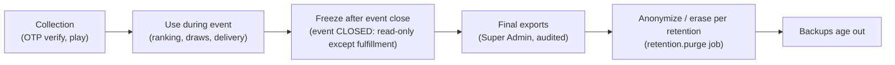

# Auditing Strategy, Retention and Data Lifecycle

## 1. Auditing layers

| Layer | Captures | Store |
|---|---|---|
| Transactional history | Attempts (all statuses), sessions, tickets, grants, draws, deliveries — status transitions with timestamps | domain tables (never deleted during event) |
| Audit log | Admin/security/sensitive actions with before/after | `audit_log` (append-only, hash chain) |
| Evaluation traces | Validation recomputation stats, reward probability rolls | `attempt_payloads.recomputed`, `evaluation_trace` |
| Draw evidence | Criteria, snapshot, seed, algorithm, winners | `draws`, `draw_entries`, `draw_winners` |
| Delivery evidence | Every external call attempt, status, error | `external_delivery_attempts` |
| Application logs | Request flow, errors (redacted) | log store, short retention |

## 2. Data classification

| Class | Data | Handling |
|---|---|---|
| P1 — direct identifier | phone number | Encrypted at rest (disk/DB-level); visible only to roles with `participant.view_phone`; masked elsewhere; never in logs/analytics |
| P2 — personal | display name, IP address, user agent, device info | Name public per policy; IP stored as keyed hash + coarse prefix |
| P3 — pseudonymous | participant_id, anon_id, scores, attempts | Analytics allowed |
| S — secret | OTP codes, session tokens, API credentials, TOTP secrets, peppers | Never stored in plaintext (hash/encrypt); never logged |
| C — confidential business | reward codes, inventory, draw seeds before completion | Admin-only; codes shown only to recipient and authorized admins |

## 3. Retention recommendations (OQ-13 — business/legal confirmation required)

Jurisdiction-specific obligations are **not** asserted here. Proposed defaults for approval:

| Data | Proposed retention | Rationale |
|---|---|---|
| OTP challenges | 30 days | Abuse investigation |
| Participant sessions | expiry + 7 days | Security |
| Raw attempt payloads (action logs) | Event end + 90 days | Dispute/anti-cheat review window |
| Attempts, progress, tickets, grants, draws | Event end + 1 year (or campaign policy) | Prize disputes, reporting |
| Phone numbers & names | Until campaign data-retention decision; then erase/anonymize | Minimization |
| Audit log | ≥ longest related data retention | Accountability |
| External delivery records | Event end + 90 days | Reconciliation |
| Analytics events | 1 year, pseudonymous | Product learning |
| Application logs | 14–30 days | Operations |
| Backups | Rolling 30 days + event-final snapshot | Recovery |

## 4. Data lifecycle

- Erasure: `participants.phone_e164 = NULL`, `display_name = NULL`, `status = ERASED`; `phone_hash` kept only if dedupe across future events is approved; attempts/tickets remain linked to the pseudonymous id for aggregate stats.
- Exports (CSV/XLSX) are generated server-side, contain the minimum columns, are logged in `audit_log` (`export.created` with filters and row count), and are downloadable once via a short-lived URL.
- Backups inherit retention: erasure is effective in backups once they age out (document this to stakeholders).
