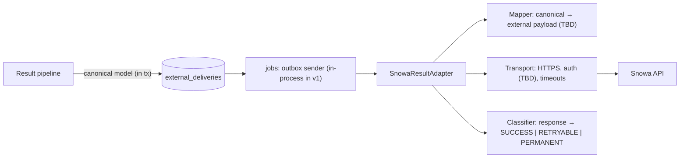
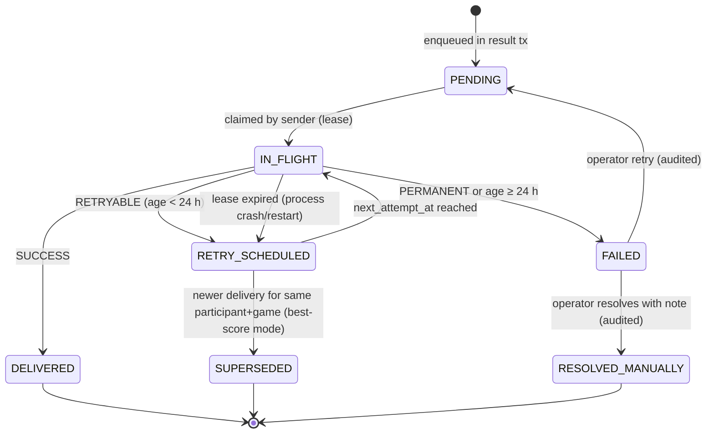
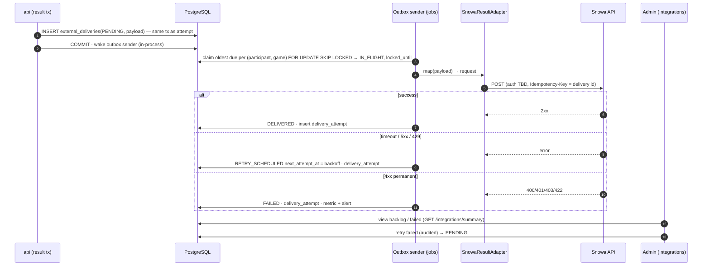

# External Snowa API Adapter Contract

Source: SPEC §17, PD-11, AC-018, API-001, API-002. Decision: [ADR-008](../11-decisions/ADR-008-external-integration.md). **The external contract is not confirmed (OQ-04). Every external field below marked TBD must be replaced by the agreed contract; nothing here is a claim about Snowa's API.**

## 1. Boundary



Adapter interface (illustrative):
```ts
interface SnowaResultAdapter {
  readonly contractVersion: string;               // e.g. "tbd-0"
  map(c: CanonicalResult): ExternalRequest;       // pure, unit-tested against fixtures
  send(r: ExternalRequest, idempotencyKey: string, signal: AbortSignal): Promise<ExternalResponse>;
  classify(r: ExternalResponse | TransportError): 'SUCCESS' | 'RETRYABLE' | 'PERMANENT';
}
```

## 2. Canonical internal result model

See [Integration architecture §3](../01-architecture/08-integration-architecture.md#3-canonical-internal-result-model-adapter-input). It always contains **both** `attempt_score` and `best_score` so the adapter can satisfy either interpretation [SPEC §17.3].

## 3. External payload mapping

| External field | Source | Status |
|---|---|---|
| `phone` | `phone_e164` → national format `09XXXXXXXXX` (SPEC example) | Known concept; format TBD |
| `game_id` | `games.external_ref` (SPEC example `1`) | TBD mapping |
| `game_name` | `game_slug` (`spin-perfect`) | Known concept |
| `score` | `best_score` (default) or `attempt_score` | TBD — default best (SPEC §17.3) |
| `name` | `display_name` | TBD — only if required |
| `event_id`, `timestamps`, `idempotency id` | canonical | TBD — only if supported |
| Endpoint URL, method | config | TBD |
| Authentication (API key / OAuth2 client credentials / HMAC signature / mTLS) | secret store | TBD |
| Response success/error schema | classifier | TBD |
| Rate limits | sender concurrency config | TBD |
| Sandbox environment | staging config | TBD |

Example of the SPEC's minimum business payload (not a confirmed contract):
```json
{ "phone": "09123456789", "game_id": 1, "game_name": "spin-perfect", "score": 8750 }
```

## 4. Delivery semantics

| Topic | Behavior |
|---|---|
| Ordering of persistence | Result committed locally **before** any delivery (outbox row in the same tx) |
| Participant impact | None — result response never waits for Snowa |
| Idempotency | `external_deliveries.id` sent as `Idempotency-Key` header (or body field) **if Snowa supports it**; otherwise duplicates on retry are possible after ambiguous timeouts — documented risk R-05 |
| Delivery mode (OQ-04) | `EVERY_ACCEPTED_ATTEMPT` (default: one delivery per valid attempt, payload score = best at that time) or `BEST_SCORE_CHANGES_ONLY` (only when `is_new_best` or first completion) |
| Ordering per participant + game | The sender delivers deliveries of the same `(participant, game)` in `created_at` order (claims only the oldest undelivered per pair). If a newer delivery exists and mode is best-score semantics, an older `RETRY_SCHEDULED` one MAY be marked `SUPERSEDED` (configurable) to avoid regressing the receiver's value |
| Concurrency | Default 4 in-flight requests; configurable to match Snowa rate limits |
| Timeouts | connect 3 s, total 10 s |
| Lease | `IN_FLIGHT` rows have `locked_until = now + 60 s`; expired leases are reclaimed (crash recovery) |

### Retry schedule (retryable failures)

| Attempt | Delay (± 20 % jitter) |
|---|---|
| 1 → 2 | 10 s |
| 2 → 3 | 30 s |
| 3 → 4 | 2 min |
| 4 → 5 | 10 min |
| 5 → 6 | 30 min |
| 6 → … | every 1 h until 24 h age |
| after 24 h | `FAILED` (requires operator) |

`429` honors `Retry-After`. Circuit breaker: after 20 consecutive retryable failures, pause dispatch for 60 s (half-open probe), raising `system_status_changed {component:"outbox", status:"degraded"}`.

## 5. Delivery state machine



## 6. External API delivery sequence



## 7. Reconciliation

| Mechanism | Purpose |
|---|---|
| `integrity.reconcile` check | Every valid attempt has a delivery row (INV-12) |
| Daily report (Admin → Integrations) | counts delivered / failed / pending per day, per game |
| Export `deliveries.csv` | For side-by-side comparison with Snowa if they provide a received-records export (TBD) |
| Replay tool | Re-enqueue deliveries by filter (date range, status) — Super Admin, audited; relies on external idempotency to be safe |
| Correction deliveries (`kind = CORRECTION`) | Only if contract supports updates/deletes after attempt invalidation (OQ-04) |

## 8. Security

- Credentials only in server secret store; never in client bundles, logs, or delivery records.
- Response excerpts stored ≤ 1 KB with tokens/PII redacted.
- Outbound allowlist: server egress only to the configured Snowa host (firewall rule when infrastructure allows).
- The participant's phone number is transmitted only because the business contract requires it (SPEC §17.1); privacy review in [Privacy](../07-security/07-privacy-and-data-protection.md).
