# Shared Game Runtime Specification

Source: SPEC §8, §20, §22.2, §25, §27, §28. Architecture: [Game runtime architecture](../01-architecture/04-game-runtime-architecture.md).

All three games share this shell. Game modules implement only mechanics, rendering and scoring rules.

## 1. Runtime state machine (client)

```mermaid
stateDiagram-v2
  [*] --> LOADING_CODE: route /games/:slug
  LOADING_CODE --> PRE_GAME: game chunk loaded
  PRE_GAME --> SESSION_ISSUING: participant views instructions
  SESSION_ISSUING --> LOADING_ASSETS: session ISSUED
  SESSION_ISSUING --> BLOCKED: 409 unavailable/exhausted → back to lobby
  LOADING_ASSETS --> READY: critical assets loaded
  LOADING_ASSETS --> ERROR: load failed (retry; session stays ISSUED)
  READY --> STARTING: participant taps start
  STARTING --> COUNTDOWN: /start OK
  STARTING --> BLOCKED: 409
  COUNTDOWN --> PLAYING: 3-2-1 complete (t = 0)
  PLAYING --> PAUSED: hidden / manual pause / orientation / back
  PAUSED --> RESUME_COUNTDOWN: visible + portrait + participant taps resume
  RESUME_COUNTDOWN --> PLAYING
  PAUSED --> ENDING: pause budget exhausted
  PLAYING --> ENDING: timer reaches durationMs
  PLAYING --> ENDING: participant confirms quit
  ENDING --> SUBMITTING: final state frozen, payload persisted locally
  SUBMITTING --> RESULT: 200 ResultModel
  SUBMITTING --> SUBMIT_RETRY: network/5xx
  SUBMIT_RETRY --> SUBMITTING: backoff 1,2,4,8,15 s… (until late_deadline)
  SUBMIT_RETRY --> SUBMIT_FAILED: late_deadline passed / 409 expired
  RESULT --> [*]
  SUBMIT_FAILED --> [*]: Persian explanation + lobby
```

Session ISSUING runs in parallel with the instruction screen so the participant rarely waits.

## 2. Initialization contract

Inputs from `POST /game-sessions`: `seed`, `params`, `configVersion`, `configChecksum`, `durationMs`, `pauseBudgetMs`. The module validates `params` against its schema (from game-core) and refuses to boot on mismatch (`ERROR` state with "please refresh" message → forces new client build if outdated).

## 3. Countdown

- DOM overlay 3-2-1 (+ Persian "شروع!"), 1 s per step, audio cue if sound on.
- Scene is visible but frozen during countdown (Vision Hunt: scene hidden until t = 0 to avoid pre-scanning).
- Countdown time is not gameplay time.

## 4. HUD (shared)

| Element | Position (portrait) | Source |
|---|---|---|
| Timer (remaining s) | top, start side | runtime, 10 Hz |
| Score | top center | `onScore` |
| Combo / state indicator | below score | `onScore` |
| Pause button | top, end side | shell |
| Sound toggle | pause menu + pre-game | shell |

Final 5 seconds: timer emphasis (color + scale + tick sound; not color-only).

## 5. Input rules

- Pointer Events on the canvas; `touch-action: none` on stage only.
- Multi-touch: only the first active pointer is used (prevents two-finger exploits in Fridge Rush/Vision Hunt).
- Input timestamps from `event.timeStamp`, converted to gameplay time (see [time model](../01-architecture/04-game-runtime-architecture.md#3-time-model)).
- No input is processed while PAUSED, during countdowns, or during a game's own lock windows.

## 6. Pause, background and interruption policy

| Trigger | Behavior |
|---|---|
| `visibilitychange: hidden`, `pagehide`, `blur` (desktop) | Immediate pause; stop audio; record pause start |
| Manual pause button | Pause with menu: resume / sound / quit |
| Orientation to landscape (phone) | Pause + rotate overlay |
| Browser back | Pause + Persian confirm "leave game? this attempt will be used" |
| WebGL context lost | Pause; attempt restore; if not restored in 5 s → end as `USER_QUIT`-equivalent `endReason: CONTEXT_LOST` and submit |
| Resume | Requires explicit tap; 3-2-1 resume countdown (not gameplay time) |
| Pause budget | Σ pause durations ≤ `pauseBudgetMs` (default 60 s). When exceeded (checked on resume or by timer while visible) → game ends immediately with current score, `endReason: PAUSE_BUDGET_EXHAUSTED` |
| Playfield while paused | Covered by opaque overlay (prevents studying Vision Hunt scenes / Fridge trays while the clock is stopped) |
| Page reload / crash during PLAYING | Not resumable. Attempt remains STARTED until late deadline → ABANDONED (approved policy, OQ-15 resolved) |
| Network loss during PLAYING | No effect; gameplay is local. Submission retries later |

## 7. End of game and submission

1. Timer hits `durationMs` → simulation freezes at exactly `t = durationMs` (inputs with `t > durationMs` discarded).
2. End animation ≤ 1.5 s ("time's up") while the payload is built and saved to `localStorage` (`pending-result:<sessionId>`).
3. `POST /result`; retries with exponential backoff (1, 2, 4, 8, 15 s, then every 15 s) until success, `409 SESSION_EXPIRED`, or `late_deadline_at`.
4. While retrying: Persian "sending your result…" with spinner; the participant may go to the lobby — the pending result is retried on next app boot/focus.
5. The result screen renders **only** the server's ResultModel (never the client score as final). The client's running score may be shown as "your score" placeholder during submission, labeled as pending.

## 8. Result screen (shared)

Order [SPEC §13.5]: attempt score → new-best badge / best score (and previous best when new) → rank → base ticket state (`granted now` vs `already active`) → extra reward cards → actions: replay (only if `canReplay`), leaderboard, lobby.

## 9. Asset loading (shared)

| Group | Content | When |
|---|---|---|
| `shell` | shared HUD icons, countdown audio, result/ticket visuals, Persian feedback bitmaps | cached after first game |
| `critical:<game>` | Everything needed for the first frame and core feedback | during PRE_GAME (progress bar only if > 400 ms) |
| `deferred:<game>` | Secondary VFX, combo effects, non-essential audio, result composition | background during COUNTDOWN/PLAYING; gameplay never waits for it (fallback: skip effect) |

Per-game manifests are content-hashed JSON (`/games/<slug>/manifest.<hash>.json`) listing texture atlases, audio sprites and sizes. Budgets: [Performance budgets](../10-performance/01-performance-budgets.md).

## 10. Audio and haptics

- Web Audio via Phaser sound manager; unlocked on the start tap.
- Audio sprites per game (one file per group) to minimize requests.
- Shared cues [SPEC §25.1]: countdown/start, correct/perfect, error/miss, combo milestone, final seconds, result reveal, raffle-ticket signature sound, extra reward reveal.
- Muted by default? **No** — sound on by default with visible toggle; games fully playable muted. iOS silent switch respected.
- Haptics: `navigator.vibrate(10–20 ms)` for high-value moments only; feature-detected; setting follows sound toggle group "effects".

## 11. Accessibility (shared)

| Need | Rule |
|---|---|
| Color independence | Every state has shape/icon/text + color [SPEC §28] |
| Flashing | No more than 3 flashes/s; no full-screen flashes; particle bursts ≤ 300 ms |
| Reduced motion | `prefers-reduced-motion`: disable camera shake, reduce particles, keep gameplay motion (it is the mechanic) |
| Touch targets | ≥ 48 dp for UI; game-specific minimums in each spec |
| Instructions | Visual (icons/animation) + ≤ 3 short Persian lines [SPEC §4.2] |
| Screen readers | Shell screens fully labeled; gameplay canvas marked `aria-hidden` with a Persian description of the game on the pre-game screen (games are inherently visual/timing-based) |

## 12. Per-game module checklist

Each game spec defines: parameters schema, simulation rules, scoring, combo, difficulty schedule, action log types, validation rules & flags, bounds computation, asset/audio/animation groups, performance notes, accessibility notes.
