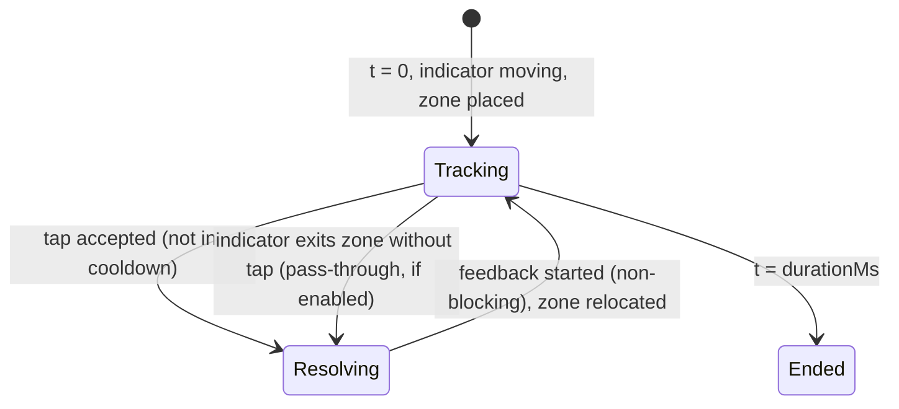

# Spin Perfect — Technical Gameplay Specification

| | |
|---|---|
| Internal id | `spin-perfect` (games.id = 1) |
| Working Persian title | لحظه طلایی (brand may rename — OQ-25) |
| Hero product | Snowa washing machine |
| Mechanic | Timing / precision: tap when the moving indicator is inside the target zone on the drum ring |
| Duration | 40 000 ms [SPEC §9.1] |
| Phase | Phase 1 vertical slice (first implemented game) |

Product behavior is preserved from SPEC §9. Values marked *tunable* are initial config values to be calibrated in the prototype; they live in `game_config_versions.params`, not in code.

## 1. State flow

Shared runtime states ([Shared runtime §1](01-shared-game-runtime.md#1-runtime-state-machine-client)). Game-internal states while PLAYING:



Feedback animations never block the next opportunity (≤ 250 ms, overlapping allowed) [SPEC §9.5].

## 2. Geometry and time model (integer math)

- Ring = `RING_UNITS = 360 000` (1 unit = 0.001°). Positions are integers modulo `RING_UNITS`.
- Indicator position `θ(t)` is a **pure function of `(params, seed, t)`**: piecewise-linear with integer speed `v` (units/ms) per segment and direction `dir ∈ {+1, −1}`. Segment boundaries = phase boundaries + seeded direction-change/tempo times. Therefore θ(t) can be evaluated on the server for any tap time.
- Target zone: center `c` (units) and half-width `h` (units) from the current phase. After each resolution (tap or pass-through), the next center is placed by PRNG at a forward distance `∈ [minGap, maxGap]` along the current direction.
- Classification of a tap at time `t`: `d = circularDistance(θ(t) + latencyComp, c)`:

| Result | Condition | Base points |
|---|---|---|
| Perfect | `d ≤ h × perfectRatio` | 100 |
| Great | `d ≤ h × greatRatio` | 70 |
| Good | `d ≤ h` | 40 |
| Miss | otherwise | 0 |

`latencyComp` (*tunable*, units derived from ms × current speed) compensates typical touch-to-event latency; it is a config constant applied identically on client and server, never per device.

## 3. Difficulty schedule (*tunable* initial values, SPEC §9.4)

| Phase | Time | Speed (rev/s) | Zone width (°) | Variation |
|---|---|---|---|---|
| P1 | 0–10 s | 0.50 | 60 | constant speed, single direction |
| P2 | 10–20 s | 0.65 | 48 | constant |
| P3 | 20–30 s | 0.75 | 40 | 1–2 seeded direction changes or tempo shifts (±15 %) |
| P4 | 30–40 s | 0.85 | 32 (smallest fair) | 2–3 seeded changes, strongest intensity visuals |

`perfectRatio = 0.25`, `greatRatio = 0.55` (*tunable*). `minGap = 90°`, `maxGap = 270°`.

**Fairness floors (enforced by the config validator):** at every phase the implied time window must satisfy Perfect ≥ ±35 ms (≈ 2 frames at 60 Hz) and Good ≥ ±90 ms. Direction changes never occur while the indicator is inside the zone or within 250 ms before entering it.

## 4. Scoring and combo

```text
on resolution(result):
  if result == PERFECT: combo += 1
  elif result == GREAT: combo += params.greatComboStep     # tunable: 0 (maintain, default) or 1
  elif result == GOOD: combo += 0                           # maintain
  else (MISS): combo = 0
  mult_permille = 1000 if combo <= 2 else 1200 if combo <= 5 else 1500 if combo <= 9 else 2000
  points = floor(base(result) * mult_permille / 1000)
  score += points
```

Multiplier table from SPEC §9.3 (combo 1–2 ×1.0, 3–5 ×1.2, 6–9 ×1.5, 10+ ×2.0). Example: Perfect at combo 3 → 120 (matches concept CA-07).

Pass-through (`params.passThroughIsMiss`, default `true`): if the indicator leaves the zone (beyond `h`) without a tap during the current pass, it resolves as Miss (combo reset, 0 points) and the zone relocates. Waiting is never rewarded.

Tap cooldown: taps within `tapCooldownMs = 150` (*tunable*) after the previous accepted tap are ignored by the simulation (still logged). Prevents spam; same rule on server.

## 5. Timers

- Gameplay timer 40 s; final 5 s emphasis.
- No early game over [SPEC §9.1].
- At `t = durationMs`: pending zone resolves as nothing (no Miss), indicator eases to stop (visual only).

## 6. Pause / background

Per shared policy. While paused the ring and indicator are hidden behind the pause overlay; θ(t) freezes (gameplay time does not advance).

## 7. Result payload (game-specific parts)

```json
{ "actions": [[412,"tap"],[1180,"tap"]],
  "stats": { "taps": 38, "perfect": 18, "great": 9, "good": 5, "miss": 6, "maxCombo": 11 } }
```

## 8. Score validation

| Check | Type | Rule |
|---|---|---|
| Replay | hard | recompute from taps; must equal claimed |
| Max taps | hard | `actions ≤ 400` |
| Ceiling | hard | `score ≤ maxScore(params, seed)` — simulation of Perfect at the earliest valid time for every opportunity |
| Theoretical ceiling (seed-independent sanity) | info | With the initial values, opportunities are ≈ 110 if every gap were `minGap` (≈ 55 for average gaps); × 200 max points ⇒ absolute ceiling ≈ 22 000, typical seed ceiling ≈ 11 000. Exact value computed per config and seed |
| Perfect rate | flag | `perfect / taps > 0.90` with `taps ≥ 20` → `PERFECT_RATE_HIGH` (*calibrate*) |
| Timing jitter | flag | std-dev of signed timing error across Perfects `< 6 ms` → `TIMING_JITTER_LOW` (*calibrate*) |
| Near ceiling | flag | `score ≥ 0.95 × maxScore` → `NEAR_SCORE_CEILING` |

Duplicate/expiry/retry: common framework ([§6](02-score-validation-framework.md#6-duplicate-expiry-and-retry-behavior-all-games)).

## 9. Assets, audio, animation

| Group | Items |
|---|---|
| critical | washer body (2.5D render, WebP/AVIF), drum layer (rotatable), ring track, target zone arcs (3 tiers), indicator, feedback word bitmaps (Persian: Perfect/Great/Good/Miss equivalents — copy TBD), base particle atlas |
| deferred | combo VFX (tier glows), final-seconds intensity layer, ring flash, result composition art |
| audio (sprite) | tap, perfect, great, good, miss, combo milestone (3/6/10), final-seconds tick, time-up |
| animations | drum spin (cosmetic, tied to θ speed), ring flash on Perfect, score pop, camera/scale punch (disabled in reduced motion), haptic light on Perfect |

## 10. Performance

- Draw calls ≤ 30; single texture atlas ≤ 2048² for critical group.
- Indicator rendered every frame from θ(t_frame); logic independent of frame rate.
- No per-frame allocations in the update loop (object pools for particles/score pops).

## 11. Accessibility

- Zone tiers distinguished by thickness/pattern + color.
- Feedback words + icons (not color-only).
- High-refresh displays (90/120 Hz) must not change classification (event timestamps, not frames) — tested in device matrix.
- Tap anywhere on the playfield (large target) [SPEC §9.1].
