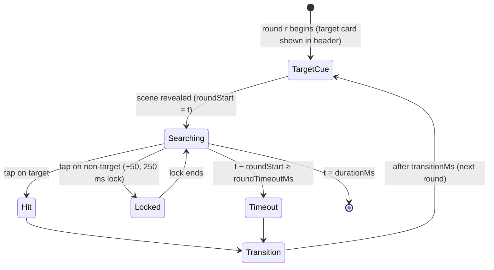

# Vision Hunt — Technical Gameplay Specification

| | |
|---|---|
| Internal id | `vision-hunt` (games.id = 3) |
| Working Persian title | شکار تصویر (brand may rename) |
| Hero product | Snowa television / branded room scene |
| Mechanic | Reaction and visual search: find and tap the shown target among distractors |
| Duration | 40 000 ms, time-boxed (see OQ-16) [SPEC §11.1] |
| Phase | Phase 4 |

Product behavior preserved from SPEC §11. *Tunable* = config parameter.

## 1. Round model

The session is a sequence of rounds within the 40 s timer:



- `TargetCue` duration `cueMs = 0` by default: the target card and scene appear together (reaction is measured from scene reveal) — *tunable*.
- `roundTimeoutMs = 5000` (*tunable*): round skipped, 0 points. SPEC does not define timeout; this prevents a stuck participant (AMB-08, OQ-16).
- `transitionMs = 300` (*tunable*): success feedback; counts toward the 40 s.
- Concept art shows a "3/5" counter and "13/15 items" — a fixed-round variant is possible; this spec uses the time-boxed model consistent with the 40 s baseline until OQ-16 is decided.

## 2. Scene generation (deterministic, seeded)

For round `r` with difficulty level `L(t_roundStart)`:
- `objectCount(L)`: 6 → 16 (*tunable* curve) [SPEC §11.3].
- Target type from the object library; distractors sampled from the library, at higher levels from the target's `similarGroup` (visually similar but fairly distinguishable).
- Positions: Poisson-disk sampling on a grid inside the TV frame safe area with min spacing so every object's touch target ≥ 48 dp and targets never overlap more than 10 %.
- Motion (after level threshold): each object moves on a deterministic linear bouncing path with integer velocities; position is a pure function of `(seed, r, t − roundStart)`.
- Obscure/fade variants (optional later levels) never rely on color alone [SPEC §11.3].
- Anti-memorization: every session has a new seed → layouts never repeat as a fixed sequence [SPEC §11.4].

## 3. Scoring

```text
on tap(round r, object o, x, y, t):
  if t within lock window: ignored (logged)
  if o == target(r):
      rt = t - roundStart(r)
      speed = 100 if rt < 400 else 80 if rt < 700 else 60 if rt < 1000 else 30 if rt < 1500 else 0
      score += params.roundBase (default 100, tunable) + speed
      next round
  else:
      score = max(0, score - 50); lockUntil = t + 250     # floor at 0 aligned with OQ-19
```

Speed bonus table and penalty from SPEC §11.2. **No combo multiplier** — SPEC defines none for Vision Hunt; the concept art's "combo ×3" is not adopted without approval (OQ-17). A visual streak counter without score effect MAY be shown.

## 4. Difficulty curve (*tunable*)

| Level | Starts at | Objects | Distractors | Motion |
|---|---|---|---|---|
| 1 | 0 s | 6 | distinct, large, static | none |
| 2 | 8 s | 9 | distinct | none |
| 3 | 16 s | 12 | some similar | none |
| 4 | 24 s | 14 | similar | slow |
| 5 | 32 s | 16 | similar | moderate |

## 5. Tap resolution

Client hit-test: object under the tap with expanded radius (touch slop 8 dp); if multiple, nearest center. Logged with normalized stage coordinates `x,y ∈ [0, 10000]`. Taps on empty space: logged as `o = null`, treated as wrong tap (penalty) — *tunable* (`emptyTapPenalty`, default `true` to prevent spam scanning).

## 6. Timers, pause, end

- 40 s timer; final 5 s emphasis.
- Scene hidden during countdown and pause (prevents pre-scanning).
- On resume, the current round's `roundStart` is shifted by the pause duration (reaction time excludes pauses).
- At `t = durationMs`, the current round ends without points.

## 7. Result payload

```json
{ "actions": [[812,"tap",0,"obj_3",5120,4410],[1650,"tap",1,null,2200,7800],[2400,"tap",1,"obj_7",6100,3000]],
  "stats": { "rounds": 22, "hits": 19, "wrongTaps": 3, "timeouts": 1, "medianReactionMs": 870 } }
```

## 8. Score validation

| Check | Type | Rule |
|---|---|---|
| Replay | hard | Rebuild rounds; each tap references the active round index at `t`; object id exists in that round |
| Hitbox | hard | `(x,y)` within the object's hitbox (+ slop) at time `t` (positions recomputed for moving objects, ±1 frame tolerance) |
| Lock window | hard | Taps inside lock windows are ignored by replay (never scored) |
| Physiological minimum | hard | correct tap with `rt < 100 ms` → `REJECTED: OUT_OF_BOUNDS` (*calibrate*) |
| Ceiling | hard | `score ≤ maxScore(params, seed)` — simulate correct taps at `rt = 100 ms` each round |
| Fast reactions | flag | median `rt < 300 ms` over ≥ 10 hits, or > 30 % hits `< 200 ms` → `REACTION_TOO_FAST` (*calibrate*) |
| Near ceiling | flag | `≥ 0.95 × maxScore` |

Residual risk: the seed is known to the client at session start, so a modified client can compute target positions. Hitbox + reaction-time plausibility make such scores detectable; see [Anti-cheat](../07-security/03-anti-cheat-and-score-integrity.md).

## 9. Assets, audio, animation

| Group | Items |
|---|---|
| critical | TV frame / room scene background (per level variants), object library atlas (target + distractors, readable silhouettes), target card frame, hit/wrong markers |
| deferred | higher-level scene layers, motion effect sprites, result art |
| audio | hit (tiered by speed), wrong tap buzz, round transition, final seconds, time-up |
| animations | target highlight ring on hit, +points pop, wrong-tap shake (reduced in reduced motion), input-lock visual (dim + icon) |

## 10. Performance & accessibility

- Object sprites from one atlas; ≤ 16 moving sprites; no per-frame allocation.
- Target card shows the object image + Persian name (not color-only).
- Similar distractors must remain fairly distinguishable at 360 px (art review).
- Input lock indicated visually (dim + icon), not only by sound.
