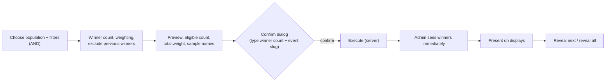

# Live Operations: Leaderboards, Live Scores, Raffle Control, Displays, Integrations

## 1. Live leaderboard (admin)

- Per-game tabs; full ranking with keyset paging; columns: rank, name, masked phone, best score, achieved at (Tehran time), attempts, flags badge.
- Updates via `leaderboard_changed` hints (≤ 1/s/game); pause-updates toggle for reviewing.
- Actions: open participant, exclude from ranking (reason), show on displays.
- Top-N review panel: flagged attempts among top 50 per game (supports pre-prize review).

## 2. Live score feed

Stream of `attempt_accepted`/`attempt_rejected`: time, game, public name, score, new-best badge, flags. Bounded list (last 200). Operational visibility only — not the source of truth [SPEC §14.3].

## 3. Live raffle control

Rules:
- Execute button disabled while request in flight; Idempotency-Key per confirm dialog instance.
- After execution the draft cannot be edited; "run again" creates a new draft (optionally copying criteria) — the history makes repeated runs visible.
- Void (Super Admin) requires reason; displays exit draw mode.
- Winner detail: name, masked phone, reveal phone (permission), tickets count, games completed — to support prize handover (winner contact process OQ-28).

## 4. Public display control

| Mode | Content |
|---|---|
| `leaderboard` | one game's top 10–20 |
| `rotate` | cycles games every N s (default 20) |
| `draw` | presentation of a specific draw |
| `idle` | branded attract screen + QR to play |

Operator switches mode per display or for all. Display shows connection state; admin sees each display's last heartbeat.

## 5. External API delivery monitoring

| Widget | Content |
|---|---|
| Health badge | OK / degraded (backlog > 100 or oldest pending > 5 min) / down (circuit open or 0 successes in 10 min) |
| Counters | pending, retry scheduled, in flight, delivered (today), failed, superseded |
| Oldest pending age | seconds |
| Error categories | timeout / 5xx / 429 / 4xx / auth |
| Deliveries table | filter by status/game/date; attempt history per delivery |
| Actions | retry one (Admin+), retry all failed (Super Admin), resolve manually with note |
| Integration toggle | pause/resume dispatch (Super Admin) — deliveries keep queuing while paused |

## 6. OTP provider health

Send success rate (5 min), median send latency, failures by category, current rate-limit blocks. Alert when success < 90 % over 5 min.
