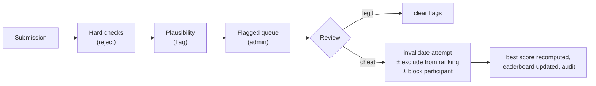

# Anti-Cheat and Score Integrity

Source: SPEC §21, §21.1. Framework: [Score validation](../05-games/02-score-validation-framework.md). Decision: [ADR-010](../11-decisions/ADR-010-score-validation.md).

## 1. Realistic goal

A browser game cannot be made cheat-proof: the client code, seed and rules are on the attacker's device. The goal [SPEC §21.1] is to make leaderboard/reward manipulation **materially harder and detectable**:

| Attack class | Effort | Outcome with this design |
|---|---|---|
| Edit request (`score: 999999999`) | trivial | Rejected (score recomputed; bounds) |
| Replay/duplicate requests | trivial | No effect (idempotent; one result per session) |
| Reload for better seed/layout | trivial | Costs an attempt each time |
| Speed hacks / time manipulation | low | Server wall-clock lower bound on elapsed time; pauses bounded |
| Modify client to auto-play (bot) | high | Plausibility flags; top-rank review; invalidation |
| Craft plausible logs offline | high | Same as bot; bounded by hard limits; detectable statistically |
| Many phone numbers | medium | Not preventable technically; each account limited individually |

## 2. Server-authoritative session model

| Concept | Role |
|---|---|
| `game_session_id` | UUIDv4 bound to participant; required for every result |
| `participant_id` | from auth cookie only |
| `game_id`, `config_version` | pinned at issue; mismatches rejected |
| `attempt_number` | assigned by server at start |
| `issued_at` / `start_by` | window to begin |
| `started_at` | server clock anchor |
| `deadline_at` / `late_deadline_at` | submission window |
| `seed` | server randomness for layouts/sequences |
| submission status | `STARTED → SUBMITTED` once |
| nonce / anti-replay | the session id itself is single-use (one accepted result); a separate nonce adds nothing because the session is already bound server-side and unguessable |

## 3. Detection pipeline

Monitoring: alert when flagged rate for a game > 5 % in 15 min or any `SCORE_MISMATCH` spike (may indicate a client bug or a new cheat).

## 4. Operational controls

- Before announcing rank-based prizes or running rank-range draws: review flagged attempts in the relevant top ranks (runbook).
- Keep raw payloads for the dispute window (OQ-13).
- Config versions are frozen during a live event; bounds can be tightened between event days by publishing a new version (affects only new sessions; document the change).
- Client builds use minification but no heavy obfuscation (it would not stop determined attackers and hurts debugging); security relies on server checks.

## 5. What NOT to do

- Do not add per-frame server round trips (breaks gameplay on venue networks; violates SPEC §27).
- Do not trust any client-reported "isValid", "combo", or "rank".
- Do not use device fingerprinting to link accounts (privacy; not approved).
