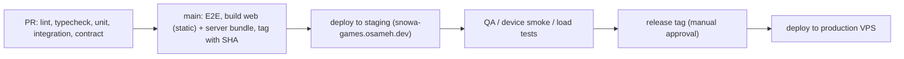

# Deployment and Rollback

v1 layout: one VPS with Nginx **or** Caddy, the static Nuxt build, one Fastify process supervised by **systemd**, and PostgreSQL ([ADR-012](../11-decisions/ADR-012-deployment-topology.md)). No Docker, no PM2 (systemd is the single process supervisor).

## 1. Server layout

```text
/srv/snowa-games/
  releases/<git-sha>/web/        static Nuxt build (index.html, hashed assets, sw.js)
  releases/<git-sha>/server/     compiled Fastify app + production node_modules
  current -> releases/<git-sha>  symlink switched atomically on deploy
/etc/snowa-games/server.env      environment + secrets (0600, root)
/var/backups/snowa-games/        local staging area for dumps before off-server upload
```

- Service user: `snowa` (no login shell, no sudo), owns nothing under `/etc/snowa-games`; releases are read-only to it.
- PostgreSQL listens on `localhost` only; app role has least privilege (no DDL, no `UPDATE/DELETE` on `audit_log`); migrations use a separate migration role.
- Firewall (ufw): allow 22 (SSH keys only, no password login), 80, 443; deny everything else.

## 2. systemd unit (illustrative)

```ini
[Unit]
Description=Snowa Games API (Fastify)
After=network-online.target postgresql.service
Wants=network-online.target

[Service]
User=snowa
Group=snowa
WorkingDirectory=/srv/snowa-games/current/server
EnvironmentFile=/etc/snowa-games/server.env
ExecStart=/usr/bin/node --max-old-space-size=512 dist/main.js
Restart=always
RestartSec=2
TimeoutStopSec=20
KillSignal=SIGTERM
NoNewPrivileges=true
ProtectSystem=strict
ProtectHome=true
PrivateTmp=true
ReadWritePaths=/var/log/snowa-games

[Install]
WantedBy=multi-user.target
```

- Startup: `systemctl enable --now snowa-games`.
- Restart policy: `Restart=always`; systemd restarts within ~2 s after a crash.
- Graceful stop: `SIGTERM` → Fastify drains (see [Backend architecture §1](../01-architecture/05-backend-architecture.md#1-process-model)).
- Logs: stdout/stderr JSON to journald (`journalctl -u snowa-games`), journald size capped (e.g., `SystemMaxUse=1G`), retention 14–30 days; reverse-proxy access logs rotated by logrotate.
- Health: `GET /healthz` (process up) and `GET /readyz` (DB reachable, migrations current); used by the external uptime monitor and by the deploy script.

## 3. TLS

Let's Encrypt via Caddy's automatic HTTPS, or Nginx + certbot with the systemd timer for renewal. Renewal verified (`certbot renew --dry-run` or Caddy logs) at setup and before the event; certificate-expiry alert ≥ 14 days.

## 4. Pipeline



Builds never run on the VPS (memory); CI produces a release archive (web + server + lockfile-installed production dependencies) copied over SSH.

## 5. Deployment procedure

1. Confirm no live draw presentation in progress; prefer low-traffic windows.
2. Upload release archive to `releases/<sha>/` and verify checksum.
3. Take an on-demand database dump (pre-deploy backup).
4. Run migrations (`node server/dist/migrate.js` as the migration role); expand-only (§6).
5. Switch `current` symlink atomically. Static files take effect immediately (old hashed assets stay in previous release dirs; the proxy serves old asset paths from a shared `assets/` directory kept ≥ 7 days so open clients and service workers keep working).
6. `systemctl restart snowa-games` — brief gap (typically a few seconds). Clients retry idempotent calls; SSE clients reconnect; pending game results remain in `localStorage` and are resubmitted; accepted data is unaffected.
7. Smoke test: `/readyz`, test participant login (staging fake OTP / production test phone), start + submit a game, admin dashboard stream, outbox backlog normal.

## 6. Database migrations

- Expand/contract: additive changes first; code tolerant of both schemas; destructive changes after the event.
- Forward-only; each has a rollback plan (usually "keep expanded schema, redeploy previous release").
- No long migrations during event hours.

## 7. Event-day change freeze

- From T-24 h to event close: code deployments only for Sev-1/Sev-2 fixes approved by the incident lead.
- Game config versions frozen during event days (publish only between days).
- Live controls (games, attempts, rewards, draws) remain available — they are the purpose of the admin panel.

## 8. Rollback

| Situation | Action | Target |
|---|---|---|
| Bad server build | Point `current` to previous release, `systemctl restart snowa-games` | < 5 min |
| Bad static build | Point `current` to previous release (web is part of the release) | < 5 min |
| Bad game config version | Re-activate previous published version for new sessions | minutes |
| Bad reward rule | Pause rule; revoke erroneous grants (audited) | minutes |
| Bad migration / data corruption | Restore from pre-deploy dump or latest backup — data-loss window; incident lead decision | per RPO |
| VPS lost | Provision new VPS from the setup runbook, restore latest off-server backup, repoint DNS | per RTO |

## 9. Client compatibility

- `426 CLIENT_UPGRADE_REQUIRED` when a game runtime older than `runtime_min_version` creates a session; the client reloads. Never mid-game.
- `buildHash` in the SSE `hello` event lets displays reload between draws.

## 10. Future (scaling stages 4–5)

With a separate worker or multiple Fastify instances, the same release is started with different entrypoints/units (`snowa-games-worker.service`, `snowa-games@N.service`) and the proxy balances instances, enabling zero-downtime rolling restarts. No change to the release format.
