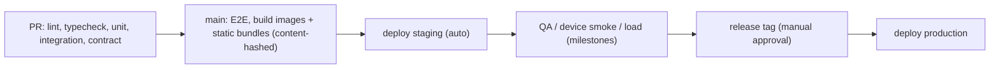

# Deployment and Rollback

## 1. Pipeline

Artifacts: one server image (api/worker/migrate entrypoints) tagged with git SHA; static participant and admin bundles uploaded to the proxy's static root (or CDN) **before** switching API.

## 2. Deployment procedure (production)

1. Announce window; confirm no live draw in progress (admin "draw lock" check).
2. Run `migrate` (expand-only migrations; see §3).
3. Upload new static bundles side by side (hashed filenames; old files kept ≥ 7 days so open clients and service workers keep working).
4. Rolling restart API replicas (drain: stop accepting new connections, finish in-flight, SSE clients reconnect elsewhere).
5. Restart worker.
6. Switch `index.html` / service-worker version to the new build.
7. Smoke test: health, login with test account, start/submit a test game in a hidden test event or with a test participant, admin dashboard stream.

## 3. Database migrations

- Expand/contract: deploy additive changes first; code tolerant of both schemas; destructive changes only after the event or in a later release.
- Migrations are forward-only; each has a tested rollback plan (usually "leave expanded schema, redeploy old code").
- Long migrations never run during event hours.

## 4. Event-day change freeze

- From T-24 h to event close: code deployments only for Sev-1/Sev-2 fixes, approved by the incident lead.
- Config versions (gameplay tuning) frozen during event days (publish only between days, documented).
- Live controls (games, attempts, rewards, draws) remain available — they are the purpose of the admin panel.

## 5. Rollback

| Situation | Action |
|---|---|
| Bad API build | Redeploy previous image tag (schema compatible by expand/contract) — target < 10 min |
| Bad static build | Point `index.html`/SW to previous build hash (files still present) |
| Bad game config version | Activate previous published version for **new** sessions (existing sessions keep pinned version) |
| Bad reward rule | Pause rule; revoke erroneous grants if needed (audited) |
| Bad migration | Restore from PITR only as last resort (data loss window!) — requires incident lead decision |

## 6. Client compatibility

- Server returns `426 CLIENT_UPGRADE_REQUIRED` when a game runtime older than `runtime_min_version` tries to create a session; the client reloads (new SW activates). Never mid-game: the check happens at session creation.
- `buildHash` in SSE `hello` lets displays reload between draws.
