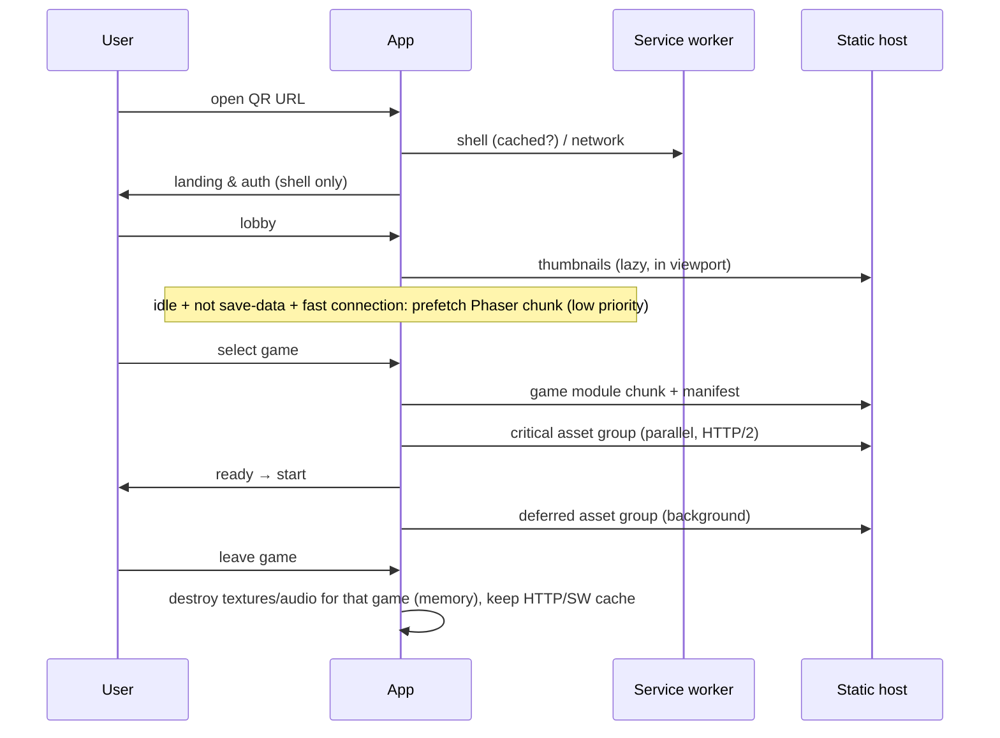

# Caching, Lazy Loading and Network Resiliency

## 1. HTTP caching

| Resource | Cache-Control | Notes |
|---|---|---|
| `index.html`, `sw.js`, `manifest.webmanifest` | `no-cache` (revalidate) | Enables fast updates |
| Hashed JS/CSS/fonts/images/audio/atlases | `public, max-age=31536000, immutable` | Content-hashed filenames |
| Game manifests (`manifest.<hash>.json`) | immutable | Referenced from API with hash |
| API responses | `no-store` | Authority is the server |
| SSE | `no-cache`, `X-Accel-Buffering: no` | |

## 2. Service worker strategy (Workbox or hand-written, small)

| Route | Strategy |
|---|---|
| App shell (HTML) | Network-first with 3 s timeout → cached shell fallback |
| Hashed static assets | Cache-first (precache shell subset at install) |
| Game asset groups | Cache-first, runtime-cached on first use, per-game cache names (`game-spin-perfect-<ver>`), old versions purged on activate |
| `/api/*` | **Network only** (never cached) |
| Fonts | Cache-first |

Update flow: new SW installs in background; activates on next navigation outside gameplay (never swaps mid-game); `skipWaiting` only from lobby when no game route is open.

Offline: the shell can open offline and show a Persian "no connection" state; gameplay cannot start without a server session.

## 3. Lazy loading plan

## 4. Network resiliency

| Mechanism | Detail |
|---|---|
| Timeouts | API calls 10 s (OTP request 15 s) |
| Retries | Idempotent calls: exponential backoff with jitter (1, 2, 4, 8 s…); never auto-retry non-idempotent calls without key |
| Offline detection | `navigator.onLine` + failed fetch; banner in Persian |
| Gameplay | No network during play |
| Result delivery | localStorage-persisted payload + retries + late window |
| Venue network | Small payloads, HTTP/2 multiplexing, compression; consider on-site booth Wi-Fi (ops decision) |
| Slow asset loads | Progress indicator after 400 ms; cancel/back to lobby without consuming an attempt |
