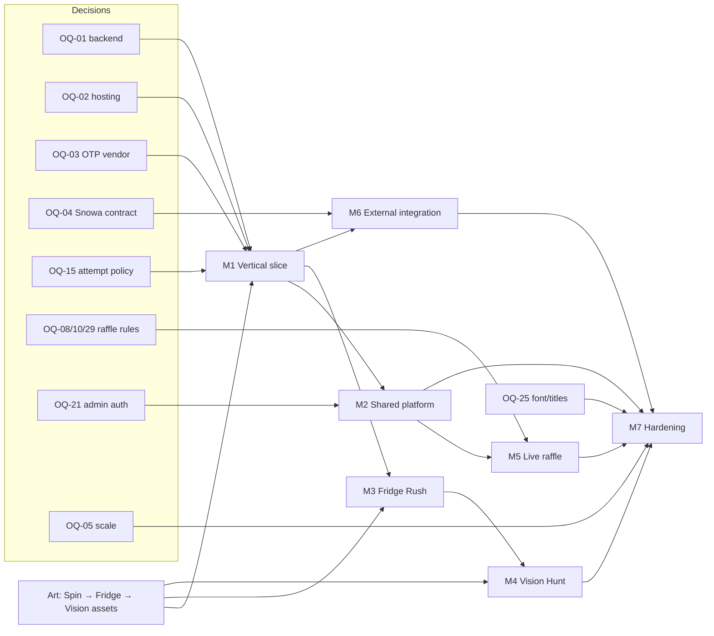

# Engineering Milestones and Dependency Map

Milestones follow SPEC §31 phases. Durations are relative estimates for a small team (2 frontend/game, 1–2 backend, 1 QA, DevOps part-time) and must be re-planned once the event date (OQ-22) is known.

## 1. Milestones

| ID | SPEC phase | Scope | Exit criteria | Est. |
|---|---|---|---|---|
| M0 | 0 | This documentation; approvals of blocking items | [Definition of ready](05-definition-of-ready.md) | — |
| M1 | 1 Vertical slice | Monorepo, CI, DB core schema, OTP (fake + real vendor in staging), name, lobby, session protocol, Spin Perfect (game-core + Phaser), result pipeline (best score, base ticket, outbox skeleton + fake receiver), participant leaderboard (REST), staging deploy | AC-001, 002, 003 (slice), 006–009, 011, 012, 019, 020 on Spin Perfect; device smoke | 5–6 weeks |
| M2 | 2 Shared platform | Admin app (auth+TOTP, RBAC, dashboard, games control, participants, attempts review, audit), reward engine + code pools, SSE real-time, public display (leaderboard), analytics ingest | AC-005, 010, 013, 014, 017, 022 | 4–5 weeks |
| M3 | 3 Fridge Rush | game-core + scene, drag/drop, calibration | AC-021 for Fridge Rush; validation tests | 3 weeks |
| M4 | 4 Vision Hunt | seeded scenes, hitbox validation, calibration | AC-021 for Vision Hunt | 3 weeks |
| M5 | 5 Live raffle | draws, snapshot, selection, presentation/reveal, verify tool | AC-015, 016; RF tests | 2–3 weeks |
| M6 | 6 External integration | Real Snowa adapter, retries, reconciliation, admin monitoring | AC-018 against sandbox | 1–2 weeks (after contract) |
| M7 | 7 Exhibition hardening | Device matrix, load/failure tests, anti-cheat tuning, runbook, rehearsal | All AC; rehearsal sign-off | 2–3 weeks |

## 2. Dependency map

M3 can start in parallel with M2 once the shared runtime from M1 is stable (separate engineers). M6 can proceed whenever the contract arrives.

## 3. Critical path

OQ-01/OQ-02 decisions → M1 → M2 → M5 → M7, with art production and the Snowa contract as parallel external dependencies.
